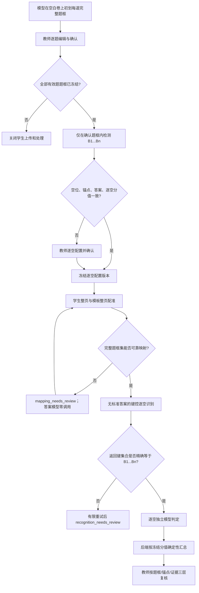

# 题框与逐空批改链路 Code Review

## 结论

截图中的问题不是“模型偶尔少识别一个空”，而是旧链路把三种不同对象混在了一起：完整题框、空位身份、识别证据。第 11 题实际有三个空，但两个图像片段被按位置当成三个空的来源，最终形成 B1 吞入两个答案、B2 得到 `CD`、B3 为空的错位结果。题框不完整又使模型看不到整道题，进一步放大了错误。

这是通用建模和流程问题，不能通过给第 11 题增加坐标或答案特判解决。修复后的生产链路只依赖当前已确认题框集、已确认逐空配置、页面配准版本和模型的运行时键控结果；第 8/11 题只保留为测试回归样本。

## 原处理链路为什么会失败

| 问题 | 旧链路表现 | 对截图的直接影响 |
| --- | --- | --- |
| 完整题框与答案区域混用 | 局部答案框、识别裁块或其外接范围被当成题目范围；前端还可能重构/扩张范围 | 框只覆盖题目上半部分或 A 选项，图和其余选项不在模型上下文内 |
| 空位身份来自数组位置 | 区域、文本段或换行顺序被隐式绑定到 B1、B2、B3 | 一个片段中的“电荷转移 遵守”整体进入 B1，第二片段 `CD` 进入 B2，B3 缺失 |
| 空数与证据块数量耦合 | 两个视觉证据块会被误解为两个语义空；共享上下文时尤其明显 | “实际三个空”无法由两个局部框稳定恢复 |
| 只给总分时自动均分 | 5 分三空被机械分成 1.66/1.66/1.68 | 配置看似完整，实际没有逐空分值来源，错误被提前固化 |
| 识别与判分职责混合 | 标准答案或正确性信息可能参与转写，模型同时猜答案身份和对错 | 错位后难以判断是 OCR、绑定还是评分问题，也存在答案泄漏风险 |
| 当前状态覆盖历史事实 | 题框、配置、映射和评分没有完整绑定到同一版本快照 | 教师改框或重处理后，旧评分页面可能展示新坐标，无法审计当时依据 |

旧结果中的 B1/B2/B3 说明文字其实已经暴露了上述链路：系统知道标准答案有三个，却只拿到两个可按位置解释的学生片段，于是把“片段数量”错误地当成“空位身份”。模型批改无法修复一个在进入模型前已经错位的数据结构。

## 修复后的唯一处理过程

## 代码审查结果

### P0：题框必须成为模板侧事实

- `question_frames/service.py` 将草稿、逐题确认、冻结和版本分叉分开；模型置信度不能自动确认。
- `question_frames/validation.py` 对页码、坐标、面积、越界、重复片段和不可接受的跨题重叠做统一校验。
- `api/question_frames.py` 的写接口要求预期版本，避免两个教师页面后写覆盖先写。
- `TemplateQuestionFrameEditor.tsx` 在空白模板原页编辑完整题框，不再把答案框或学生识别证据冒充题框。

结果：只要一题缺框、未确认或存在阻断几何问题，学生上传和处理都失败关闭。

### P0：学生侧只能映射，不能重新猜题框

- `alignment/regions.py` 的批量映射以冻结 frame set 为输入，一次映射全部有效题片段，并校验缺页、退化、裁切、越界和跨题冲突。
- `jobs/student_pipeline.py` 不调用学生侧题目边界识别；它捕获 frame/config/processing/alignment 版本后才识别答案。
- `alignment/overrides.py` 的教师修正作用于整页对应关系和控制点；修正后重算该页全部题框，不提供“只拖动一道学生题框”的掩盖路径。
- `api/submissions.py` 在低质量或不完整映射时返回带 `layer/code/nextAction` 的问题，且不会调答案模型。

结果：题框不再随每份学生卷漂移；低质量配准不会产生“看似可批改”的局部答案。

### P0：空位数量与身份必须是显式版本对象

- `recognition/blank_detection.py` 在完整题框内生成连续 `B1...Bn`，空数不由证据块数决定。
- `grading/blank_config_confirmation.py` 和评分配置 API 只读预览、不静默保存；保存会创建不可变配置版本。
- 自动确认要求空位、独立锚点、逐空答案和显式逐空分值完全一致，且分值用十进制校验守恒。
- 只有总分时不会自动均分；第 11 题需要教师明确给出 1/1/3，不能把 1.66/1.66/1.68 当成正确配置。

结果：任意正整数空数走同一规则；共享视觉上下文不再改变空位身份。

### P0：识别必须按键、无答案泄漏并严格失败关闭

- `recognition/prompts.py` 将第一阶段限制为转写，标准答案、同义词、正确性和逐空分值不进入请求。
- `recognition/parser.py` 与 `recognition/service.py` 要求返回键集合精确等于运行时 K；顺序可变，但缺键、重键、多键、未知证据和矛盾留空状态均拒绝。
- 结构错误最多重试一次；再次失败进入复核，不按换行、数组下标、片段顺序或整题摘要补齐。
- `student_blank_responses` 保存每空文本、证据引用、模型/提示版本和 frame/config/processing 版本。

结果：即使模型把 B3 放在响应第一项，也仍按 `blankKey=B3` 正确保存；返回两个片段不能再伪装成三个答案。

### P0：模型逐空判定，后端确定性计分

- `grading/fill.py` 对每个合法且非可靠留空的键分别调用模型；精确文本匹配也只是校验信号，不绕过模型要求。
- 模型只能返回同一个键的 `correct/incorrect/needs_review`、理由与置信信息，不能改键、标准答案、满分或总分。
- `jobs/grading_pipeline.py` 只读取当前处理代次中键集合完整的 `student_blank_responses`；整题摘要、换行和 segment fallback 不再是评分输入。
- 后端使用冻结配置的 Decimal 分值汇总；工具校验与模型冲突时转教师复核。
- `grading/review.py` 支持教师只修正某一个键，使用版本 CAS，其他空保持不变并留下审计。

结果：第 11 题应形成三个独立结果，而不是让模型从“电荷转移 遵守”中猜哪部分属于 B1。

### P1：历史结果必须按当时版本展示

- 数据库 v8 保存不可变的 frame set、blank config、processing revision、alignment revision、blank response 和 grading blank result。
- `api/grading.py` 从评分运行捕获的历史处理版本返回 `questionFrames` 和 `blankAnchors`，不使用当前题框替换旧评分事实。
- `GradingWorkspacePage.tsx` 将完整题框、空位锚点和识别证据分成三个图层；缺少后端多边形时安全隐藏，不在客户端用 bbox 猜一个锚点。
- `review/history.py` 不自动信任迁移得到的 legacy 题框/配置；教师确认后通过显式“按新流程重处理”创建新处理代，旧原图、识别、评分和产物保留。

结果：教师看到的框与该次评分真正使用的版本一致，历史记录不会被当前配置“穿越修改”。

## 通用性检查

生产代码没有第 8/11 题题号、固定答案、固定坐标、文件哈希或 fixture 名称驱动的条件分支。通用测试独立覆盖不同题号、题干、页码、坐标及 1/2/3/5 空，并验证：

- 键始终为连续的 `B1...Bn`；
- 模型乱序返回不改变绑定；
- 缺任意键时失败关闭；
- 一个完整证据可以显式支持多个空；
- 不同逐空分值向量由同一聚合函数守恒汇总；
- 移除第 8/11 题 fixture 后，核心链路仍可独立证明。

## 剩余风险与上线条件

1. 第 8/11 题几何 fixture 仍标记为 `candidate`。用户已确认第 11 题确有三个空，但尚未由教师在原始页逐点确认题框和锚点，因此不能冒充正式金标。
2. 浏览器 80%、100%、125%、150% 缩放下的拖动、重画、跨页片段和四点配准仍需真实 Chrome/Edge 人工走查；自动化测试不能替代视觉验收。
3. OCR/多模态模型仍可能因低清、遮挡或手写粘连而不确定；新链路的目标是把不确定性准确路由到对应层复核，而不是宣称模型永不出错。
4. 上线前应使用真实同版空白卷与学生卷，完成“初划—教师确认—配置—映射—逐空识别—逐空批改—教师修正—历史回看”全流程抽验。

## 2026-08-10 题框保存与布局复查

本轮使用实际任务 `ab3667a5ddbe4483b24c6755d9b58430` 复现后，又确认了三个独立问题：

1. 保存单题时调用了整套题框校验。第 7/8 题已有重叠时，即使教师正在修第 1 题，也会被无关题目的错误阻断，形成无法逐题消除重叠的保存死锁。
2. 前端把 `QUESTION_FRAME_UNCONFIRMED` 当成几何阻断传给题框编辑器，造成“尚未确认，所以不能点击确认”的循环条件。
3. 三栏页面同时展示题框原页和重复的参考原页，中央编辑区最大宽度又固定为 760px；同时 15 条未确认和 3 条逐空配置问题逐条平铺，挤压了真正需要操作的画布。

修复后采用以下通用规则：

- 保存只拒绝当前题自身的非法坐标、页归属、重复键等硬错误；跨题重叠允许先保存为中间草稿，但该题确认和整套冻结仍严格失败关闭。
- 几何问题由当前题框集合实时计算并返回；普通“待确认”状态不再冒充几何问题，关联题位于 `relatedQuestionId` 时也能在两侧题目上显示。
- 对明显单栏、每题每页一个模型片段的页面，按共同内容栏补齐横向边界，并用下一题起点作为当前题下边界；多栏、多片段及教师已修改布局不自动改写。
- 参考页默认收起，中央题框画布扩展到 1120px；阻断信息按类别汇总，不再逐题重复铺满页面。
- 新增“自动补齐题框（不调用模型）”接口与按钮，整个整理过程是本地确定性几何计算，并在审计记录中写入 `modelCallCount=0`。

实际任务从 revision 0 整理到 revision 1：第 1 题宽度由 `0.472` 补到 `0.760`，第 2 题高度由 `0.085` 补到 `0.157`，第 7 题高度由 `0.459` 收敛到 `0.337`，第 7/8 题跨题重叠从 41% 降为 0。模型调用数为 0。Edge 1920×1080 实际页面验证显示参考页默认收起、告警压缩为一行摘要，中央题框可使用主要页面宽度。
