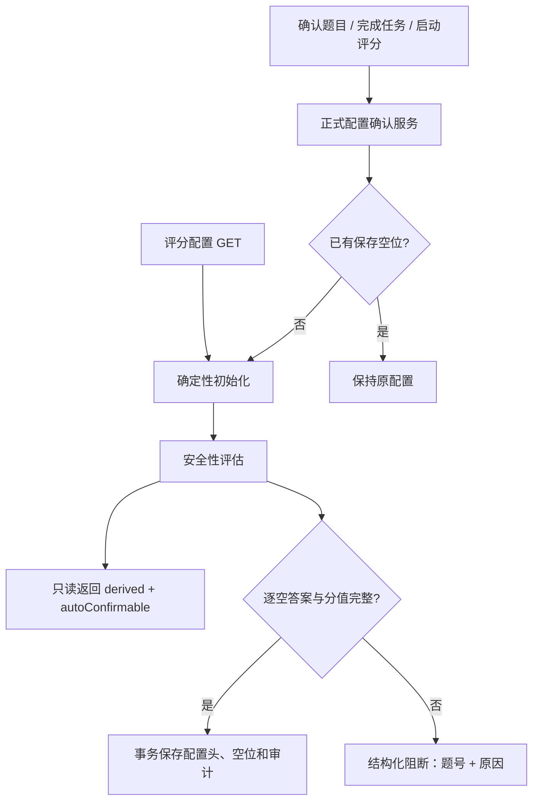

# 派生填空配置与正式批改状态一致性 Plan

> **已被部分取代（2026-08-09）：** 本文中“区域冲突不阻断”“只有总分时自动均分”“开始批改时静默生成或确认配置”等旧规则，已由 [题框驱动的逐空识别与模型批改 Spec](../2026-08-09-question-frame-blank-grading-pipeline/spec.md) 取代。本文仅保留历史记录；新流程要求 B1…Bn 的题面空位、独立锚点、标准答案和显式逐空分值严格一致。

## 架构概览

本次修复在现有确定性多空初始化模块之上增加一层“正式配置确认服务”。初始化模块继续只负责从题干、参考答案、分值和区域生成候选空位；确认服务统一判断候选是否可自动确认，并在调用方事务内保存配置头、全部空位和审计事件。

题目确认、任务完成和评分启动三个入口不再分别判断“是否有空位”，而是调用同一确认服务。已有保存空位时服务立即返回且不改数据；没有保存空位时，服务生成候选并检查逐空答案及分值。安全候选被原子保存，歧义候选转换为包含题号和原因代码的结构化阻断信息。

普通 GET 仍为只读，但返回与确认服务一致的 `autoConfirmable` 和 `blockingReasons`，使前端能够准确区分“可以由明确动作自动确认”和“必须逐空检查并手动保存”。



## 核心数据结构

### BlankInitializationReadiness

纯规则评估结果，位于初始化模块，不依赖数据库：

```python
@dataclass(frozen=True, slots=True)
class BlankInitializationReadiness:
    auto_confirmable: bool
    blocking_reasons: list[InitializationWarning]
```

`auto_confirmable` 仅在以下条件全部成立时为真：至少一个空位、每空恰有至少一个非空标准答案、每空分值大于零、所有空位分值精确等于题目满分。区域共享、区域缺失或区域数量冲突属于证据提示，不影响逐空评分配置本身；它们继续出现在 `warnings` 中，但不会把答案和分值完整的候选误判为不可确认。

### FillBlankConfigCandidate

确认服务内部使用的不可变候选：

```python
@dataclass(frozen=True, slots=True)
class FillBlankConfigCandidate:
    task_id: str
    question_id: str
    question_number: str
    max_score: Decimal
    initialization: BlankInitializationResult
    readiness: BlankInitializationReadiness
```

候选保留初始化信号和警告，用于审计及阻断详情。它不代表已经保存，只有事务内的持久化步骤成功后才成为正式配置。

### FillBlankConfigBlocker

API 错误详情中的稳定结构：

```python
@dataclass(frozen=True, slots=True)
class FillBlankConfigBlocker:
    question_id: str
    question_number: str
    expected_blank_count: int
    reason_codes: list[str]
    message: str
```

序列化后使用 camelCase：`questionId`、`questionNumber`、`expectedBlankCount`、`reasonCodes`、`message`。

### FillBlankConfirmationSummary

确认操作结果：

```python
@dataclass(frozen=True, slots=True)
class FillBlankConfirmationSummary:
    saved_question_ids: list[str]
    existing_question_ids: list[str]
```

用于测试幂等性和调用方刷新，不向普通 GET 注入写入语义。

### GradingConfigInitialization 扩展

共享前端契约增加：

```ts
interface GradingConfigInitialization {
  source: "saved" | "derived" | "none";
  signals: BlankCountSignals | null;
  warnings: InitializationWarning[];
  autoConfirmable: boolean;
  blockingReasons: InitializationWarning[];
}
```

`saved` 和 `none` 的 `autoConfirmable` 为 `false`、`blockingReasons` 为空；`derived` 使用后端纯规则评估结果。

## 模块设计

### 确定性初始化与安全性评估

**文件：** `backend/homework_judge/grading/blank_initialization.py`

**职责：**

- 保留现有空位数量、答案拆分、分值和区域初始化行为。
- 新增 `assess_blank_initialization(result, max_score)`，只根据候选空位和题目满分评估是否可自动确认。
- 对空位为空、逐空标准答案为空、分值无效或分值和不一致生成稳定阻断代码。
- 区域相关警告保持为提示；只要题干数量、逐空答案和分值完整，就允许当前第 9—12 题中的复合/冲突区域配置自动确认。

**依赖：** 仅标准库和现有初始化数据结构。

### 正式配置确认服务

**新文件：** `backend/homework_judge/grading/blank_config_confirmation.py`

**职责：**

- 在指定 SQLite 连接上查询题目、教师覆盖、匹配答案、已有配置和空位。
- 复用 `initialize_fill_blanks` 与 `assess_blank_initialization` 创建候选或阻断信息。
- 提供单题和整任务的“准备批次”函数，先完成全部评估，不写数据库。
- 仅当批次没有阻断时，保存 `question_grading_configs`、全部 `question_blank_definitions` 和 `fill_blank_config_auto_confirmed` 审计事件。
- 保存前在同一 `BEGIN IMMEDIATE` 事务内重新检查已有空位；发现已有配置时保持原值并归入 `existing_question_ids`。
- 配置头存在但空位缺失等不一致状态不自动覆盖，返回 `saved_config_inconsistent` 供人工处理。

**核心接口：**

```python
def prepare_question_fill_blank_config(
    connection: sqlite3.Connection,
    question_id: str,
) -> FillBlankConfigBatch: ...

def prepare_task_fill_blank_configs(
    connection: sqlite3.Connection,
    task_id: str,
) -> FillBlankConfigBatch: ...

def persist_fill_blank_config_batch(
    connection: sqlite3.Connection,
    database: Database,
    batch: FillBlankConfigBatch,
    actor: str,
    trigger: Literal["question_confirm", "task_complete", "grading_start"],
) -> FillBlankConfirmationSummary: ...

def ensure_task_fill_blank_configs(
    database: Database,
    task_id: str,
    actor: str,
    trigger: Literal["grading_start"],
) -> FillBlankConfirmationSummary: ...
```

`FillBlankConfigBatch` 包含候选、已存在题目和 blockers。调用方必须先检查 blockers；公共确保函数把 blockers 统一转换为 `FILL_BLANK_CONFIG_REVIEW_REQUIRED`。

### 评分配置 API

**文件：** `backend/homework_judge/api/rubrics.py`

**职责：**

- GET 继续不写数据库。
- derived 响应调用纯规则安全性评估，返回 `autoConfirmable` 与 `blockingReasons`。
- saved/none 响应补齐稳定默认字段，保持共享契约一致。
- 手动 PUT 行为不变，仍是教师显式覆盖的最高优先级。

### 题目确认与任务完成

**文件：** `backend/homework_judge/api/review.py`

**职责：**

- `confirm_question` 在现有确认事务内准备单题配置；有阻断时回滚并返回具体题号，安全时先保存配置再确认题目。
- `complete_task` 在同一事务内执行现有题目/答案门禁与整任务填空配置准备。任一普通 blocker 或填空 blocker 存在时不保存本批候选、不完成任务。
- 成功时依次保存所有安全候选、更新任务状态并记录现有任务完成审计。
- 已有保存空位不重建、不增加版本。

### 评分启动与历史任务补齐

**文件：** `backend/homework_judge/jobs/grading_pipeline.py`

**职责：**

- `create_run` 在构建题目评分输入前，根据学生提交的 task ID 调用 `ensure_task_fill_blank_configs(..., trigger="grading_start")`。
- 安全的历史缺失配置在独立原子预检事务中保存，然后现有 `_build_inputs` 读取正式空位。
- 存在阻断时不创建评分运行，返回包含全部问题题号的结构化错误。
- `run` 阶段重复构建输入时已能读取保存配置；确保函数的幂等检查避免重复版本和审计。

评分预检事务只保证“某次配置批次要么完整保存、要么完全不保存”。评分运行记录随后创建；若运行记录创建失败，已确认的合法配置仍可保留，因为它本身是有效且可审计的教师启动动作结果，不构成部分空位状态。

### 前端状态与错误引导

**文件：** `shared/contracts.ts`、`client/src/features/grading/GradingConfigPanel.tsx`、`client/src/features/grading/GradingWorkspacePage.tsx`

**职责：**

- 共享契约声明新增的自动确认字段和 blocker 详情。
- derived 且可自动确认时，面板显示“可在保存、确认题目、完成任务或开始批改时自动确认”。
- derived 但不可自动确认时，显示“需要逐空检查并保存”，不暗示后续动作会自动通过。
- 评分启动收到 `FILL_BLANK_CONFIG_REVIEW_REQUIRED` 时保留 `ApiError.details`，显示后端具体题号，并提供返回当前任务题目复核页的操作入口。
- 自动确认成功后，审核页的既有查询刷新使配置重新读取为 `source=saved`。

## 模块交互

### 确认单题

1. `confirm_question` 完成题目和标准答案原有校验。
2. 开启 `BEGIN IMMEDIATE`。
3. 确认服务重新读取题目和保存配置，准备单题批次。
4. 有 blocker：抛出结构化 AppError，事务回滚，题目仍未确认。
5. 无 blocker：保存缺失配置和审计，再更新题目/匹配确认状态。
6. 前端刷新题目详情，评分面板由 `derived` 变为 `saved`。

### 完成任务

1. `complete_task` 开启事务并读取所有有效题目。
2. 执行现有题目确认、答案匹配和孤立答案检查。
3. 确认服务一次性准备全部缺失填空配置。
4. 任一 blocker 存在：合并到任务阻断详情并回滚，不保存本次候选。
5. 全部通过：批量保存配置及逐题审计，然后更新任务为 completed。

### 启动评分

1. `create_run` 读取学生提交和 task ID。
2. 确认服务在独立事务内准备整任务缺失配置。
3. 有 blocker：不保存候选、不创建评分运行，返回具体题号与原因。
4. 全部通过：原子保存安全配置。
5. 现有 `_build_inputs` 读取保存空位、创建输入快照和评分运行。
6. 后台评分再次读取时命中已有配置，不重复写入或审计。

## 文件组织

```text
backend/homework_judge/
├── grading/
│   ├── blank_initialization.py             # 增加纯规则安全性评估
│   └── blank_config_confirmation.py        # 新增事务确认服务
├── api/
│   ├── rubrics.py                          # GET 暴露就绪状态
│   └── review.py                           # 确认题目、完成任务接入
└── jobs/
    └── grading_pipeline.py                 # 评分启动补齐历史配置

backend/tests/
├── unit/
│   ├── test_blank_initialization.py        # 安全性评估边界
│   └── test_blank_config_confirmation.py   # 新服务事务、幂等和保护
└── integration/
    ├── test_api_workflow.py                # 题目确认、任务完成门禁
    └── test_grading_api.py                 # 历史任务评分前补齐

shared/contracts.ts                         # 初始化与 blocker 契约
client/src/features/grading/
├── GradingConfigPanel.tsx                  # 自动确认/人工检查说明
└── GradingWorkspacePage.tsx                # 精确错误与复核入口

tests/ui/
├── grading-config.test.tsx                 # 面板状态测试
└── grading-workspace.test.tsx              # 启动阻断引导测试

docs/specs/2026-08-08-fill-config-persistence-fix/
├── spec.md
├── plan.md
├── task.md
└── checklist.md
```

## 技术决策

| 决策点 | 选择 | 理由 |
| --- | --- | --- |
| 普通 GET 是否保存 | 保持只读 | 避免浏览页面产生隐式写入，继续满足已有幂等约束。 |
| 自动确认触发点 | 确认题目、完成任务、启动评分 | 三者均是教师明确推进流程的动作；评分启动同时修复历史已完成任务。 |
| 安全判定 | 逐空答案完整、分值有效且总和守恒 | 这是正式逐空评分的必要充分数据条件，可确定性验证。 |
| 区域警告是否阻断 | 不阻断答案和分值完整的候选 | 评分使用学生作答证据区域；当前复合区域和区域数量冲突不应让第 9—12 题继续卡死。 |
| 批量保存 | 先评估全部、后统一写入 | 确保任务完成和历史补齐不会出现只保存前几题的部分状态。 |
| 已有配置处理 | 逐字段保持，不更新版本 | 教师手动配置拥有最高优先级，满足数据保护和幂等要求。 |
| 异常配置头 | 阻断人工处理 | 配置头存在但无空位可能代表历史不一致，自动覆盖会掩盖数据问题。 |
| 错误响应 | 新稳定代码 + 全部题号详情 | 教师能一次定位所有问题，前端不再显示无法操作的笼统提示。 |
| 数据库变更 | 不新增表或列 | 现有配置、空位和审计表已经能够表达完整状态。 |
| 模型使用 | 不调用 | 安全性评估完全由既有规则和已识别数据决定。 |

## Spec 覆盖检查

| Spec | 设计归属 |
| --- | --- |
| F1 | `assess_blank_initialization` 与确认服务统一候选评估 |
| F2 | `confirm_question`、`complete_task`、`create_run` 三入口 |
| F3 | 评分启动前的 task 级确保函数 |
| F4 | `FillBlankConfigBlocker` 与结构化 AppError |
| F5 | `complete_task` 的先评估后写入事务 |
| F6 | GET 契约、配置面板和评分工作台错误引导 |
| N1 | `BEGIN IMMEDIATE`、保存前重查和幂等测试 |
| N2 | 已有空位短路且不更新版本 |
| N3 | 单题/整任务批次事务边界 |
| N4 | 纯规则模块及零模型调用测试 |
| N5 | 独立自动确认审计事件和 payload |

设计覆盖全部需求，不引入循环依赖：初始化模块为纯规则底层；确认服务依赖初始化与数据库；API 和评分流水线只依赖确认服务，确认服务不反向依赖 API 或流水线。
