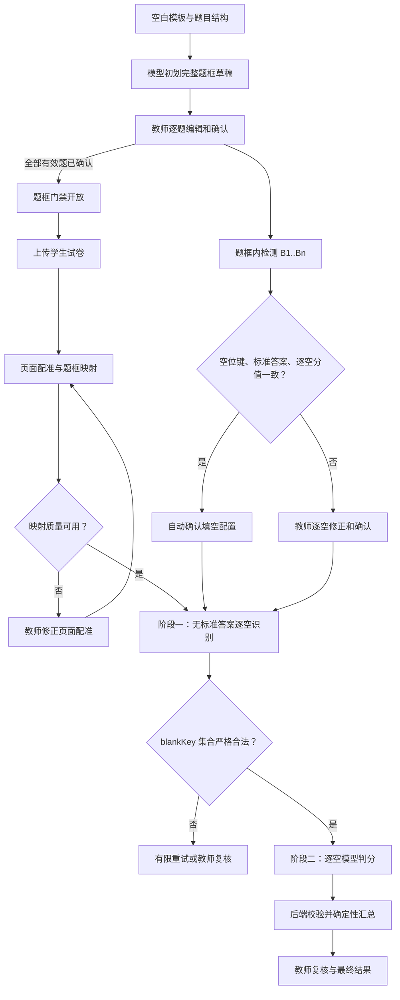
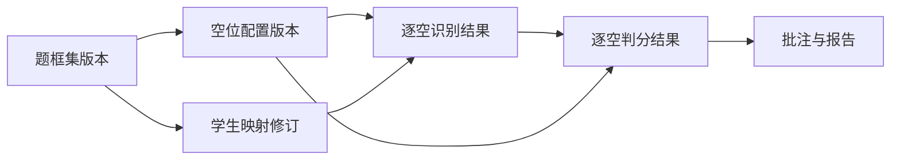

# 题框驱动的逐空识别与模型批改 Plan

## 现状代码审查与根因

当前故障不是单个识别提示词的问题，而是三个不同业务对象在现有链路中被同一个“区域数组”承担，且各层都采用了宽松降级：

1. 模板识别同时产出 `question_regions_json` 和 `answer_regions_json`，但后续学生答案识别主要消费 `answer_regions_json`。只要数组非空，`student_pipeline.py` 的补全逻辑就不再检测其是否完整或是否与空位数量一致。
2. 第 11 题的模板数据中，第一个答案区域同时覆盖“电荷转移、遵守、CD”，第二个区域误落在 A 选项。识别提示词却要求“每个输入区域恰好返回一个 segment”，模型只能把三个答案压进两个 segment。
3. `grading_pipeline.py` 再按 segment/区域下标绑定 B1、B2、B3；只有“恰好一个 segment”时才尝试按换行拆分。因此实际结果成为 B1=`电荷转移 遵守`、B2=`CD`、B3=空，而不是三个独立答案。
4. `blank_initialization.py` 能从题面推断三个空，却无法在两个区域中可靠分配三个空；`blank_config_confirmation.py` 又把 `blank_count_conflict`、`answer_region_count_conflict` 和 `composite_region_shared` 当作非阻断警告，导致错误配置被自动确认。
5. 当前模板题框只要非空即可沿用，模型自报高置信度不会证明范围完整。第 11 题题框实际在选项区中途结束，第 8 题也存在框未覆盖全部选项的风险。学生页映射即使几何正确，也只会忠实映射这个不完整模板框。
6. `ReviewPage.tsx` 只展示普通图片和答案区域配置，没有完整题框编辑器；复核 API 不返回完整题框状态和版本。批改页的蓝色虚线来自 `evidence`，但视觉上容易被理解为整题题框，掩盖了上游范围错误。
7. 学生页前端还会把题框与答案框合并、把同题片段取外接矩形，并对部分题型向下一题延伸。这个浏览器端启发式会继续改写后端范围，使页面展示和实际识别输入都失去唯一事实来源。
8. `allocate_blank_scores()` 会在没有逐空分值时自动均分总分。第 11 题因此显示 1.66/1.66/1.68，但项目中的逐空金标是 1/1/3；这说明“答案配置正确”还必须包含逐空分值来源和总分守恒。

因此修复策略必须是“上游事实收紧 + 分层门禁”，而不是继续调整区域过滤阈值或让判分模型猜测 segment 应属于哪个空。

## 通用性约束

第 8/11 题只承担回归夹具角色，生产链路不认识任何具体样本。通用实现遵循以下约束：

- 题框服务只接收任务、有效题集合、模板页和模型候选，不读取题号含义；所有题型都走同一个 frame set 状态机。
- 空位数量 `n`、`B1...Bn` 和阅读顺序来自当前题目的运行时检测/确认配置，不预设三个空，也不通过答案区域数量决定 `n`。
- 空位、答案和分值的协调器以集合/计数不变量工作，同一算法覆盖 1、2、3、5 以及更多空；同一行、跨行、多个小问和共享视觉上下文只改变输入数据，不改变代码路径。
- 学生识别和判分均遍历配置中的 `blankKey`，不包含题号、固定答案、固定页码、固定坐标或题型样本分支。
- oracle、源文件哈希和示例答案只能位于 `backend/tests/fixtures` 或测试代码；生产模块不得导入测试资源，也不得以 fixture 名称触发行为。
- 通用参数化测试是正确性的主证据，真实第 8/11 题仅验证真实排版没有击穿这些规则；删除真实样本夹具后，核心测试仍必须成立。

## 架构概览

系统拆成五个按版本串联的层级：

1. **模板题框层**：模型为任务生成一套题框草稿，教师在模板原页逐题编辑并确认；全部题目确认后冻结为任务级题框集版本。每份学生处理固定引用同一个题框集 ID。
2. **填空配置层**：只在已确认题框中检测空位；题面空位、标准答案和键集合一致时，以题目总分确定性生成逐空分值并自动确认。视觉锚点是可选提示，缺失或共享时使用完整题框作为共同识别上下文；教师版本始终优先且不会被自动覆盖。
3. **学生映射层**：学生页与模板页只做页面级配准，将确认题框批量映射到学生原页；质量失败时修正页面对应/控制点后重算。
4. **逐空识别层**：模型读取完整题框和预期空位键，在不知道标准答案的条件下返回键控转写；严格解析器要求键集合完全一致。
5. **逐空判分层**：模型依据已经落库的键控答案与确认标准答案逐空判定，后端验证结构并确定性汇总。

每一层的输出都记录输入版本。上游版本变化时，下游数据只标记过期，不原地篡改历史快照。



## 状态机与门禁

### 模板题框状态

`draft -> confirmed -> superseded`

- 模型初划或历史迁移创建任务级 `draft` 题框集，其中每道题的题框项为 `pending`。
- 教师可编辑当前草稿；每次保存增加乐观锁 `revision`，被编辑题重新变为 `pending`。教师逐题确认后，只有所有有效题都确认且全局几何校验通过，整套题框才可冻结为 `confirmed`。
- 已冻结题框集不可原地修改。编辑时从它分叉出下一版本草稿，未修改题目的确认状态可携带，被修改题必须重确认；旧版本保留并在新版本冻结后标为 `superseded`。
- 当前指针一旦切到新草稿，学生上传和新处理立即关闭；任务上传门禁只认可当前题框集为 `confirmed`。

### 填空配置状态

`pending -> auto_confirmed | teacher_confirmed -> stale`

- 自动确认要求题面标记数与逐空标准答案数相等、键集合完整连续且题目总分为正有限值。没有教师逐空分值时，协调器以 `Decimal` 和最小计分精度等额分配，最后一个或稳定顺序中的尾部空位吸收余数，保证总分守恒。
- 空位锚点可缺失或共享；此时记录 advisory，并由确认的完整题框向所有 `blankKey` 提供共享视觉证据。只有已经提供但页码/范围/面积非法或超出题框的锚点才阻断。
- 空位身份、答案、分值或已提供锚点的几何冲突保持 `pending` 并列出阻断项。
- 所依赖的题框版本或题目结构变化后进入 `stale`。

### 学生答卷状态

不扩展受 SQLite CHECK 约束的旧提交状态，而在每个 `StudentProcessingRevision` 上使用：

`uploaded -> aligning -> mapping_needs_review | recognizing -> recognition_needs_review | ready | failed`

- `mapping_needs_review` 只能通过页面对应/配准校正并重新映射离开。
- `recognition_needs_review` 保存原始响应和问题，但不进入自动判分。
- 上游版本变化后，旧 `ready` 处理修订保留但不再是 current，并创建新的处理修订。

## 核心数据结构

### `QuestionFrameFragment`

```text
regionKey: string
templatePageId: string
pageNumber: integer
x, y, width, height: number in [0, 1]
sortOrder: integer
source: "model" | "teacher" | "legacy"
confidence: number | null
issues: string[]
```

一道题包含一个或多个片段。`regionKey` 在同一题框集中稳定且唯一；片段顺序用于跨页阅读顺序，不代表空位顺序。

### `QuestionFrameSet`

```text
id: string
taskId: string
versionNumber: positive integer
status: "draft" | "confirmed" | "superseded"
revision: non-negative integer
baseFrameSetId: string | null
source: "model" | "teacher" | "legacy"
contentHash: string
items: QuestionFrameItem[]
createdAt / createdBy / updatedAt
confirmedAt / confirmedBy
```

### `QuestionFrameItem`

```text
frameSetId: string
questionId: string
status: "pending" | "confirmed"
revision: non-negative integer
fragments: QuestionFrameFragment[]
issues: string[]
carriedFromItemId: string | null
confirmedAt / confirmedBy
```

服务层按 `frameSetId` 读取整套一致快照；`tasks.current_question_frame_set_id` 指向当前集。`versionNumber` 标识业务版本，`revision` 只用于草稿并发控制，二者不得混用。

### `BlankAnchor`

现有 `question_blank_definitions.region_json` 升级为带页码的对象：

```text
pageNumber: integer
x, y, width, height: number in [0, 1]
source: "model" | "teacher"
confidence: number | null
issues: string[]
```

版本化 `QuestionBlankDefinition` 保存稳定的 `blank_key`、标准答案、答案类型和满分，并引用其依赖的 `frameSetId`。没有可靠视觉锚点时保存 `region=null`；这不会阻止自动/教师确认，识别阶段改用完整题框共享上下文。当前产品不要求教师手工绘制独立锚点。

### `BlankConfigVersion`

```text
id: string
questionId: string
versionNumber: positive integer
frameSetId: string
status: "pending" | "auto_confirmed" | "teacher_confirmed" | "stale"
source: "model" | "teacher" | "legacy"
signals / blockers / advisories
blankDefinitions: QuestionBlankDefinition[]
createdAt / createdBy / confirmedAt / confirmedBy
```

确认版本不可原地覆盖。新检测或教师编辑产生下一草稿版本，现有 `question_grading_configs` 只保留当前版本指针和兼容摘要。

### `BlankConfigReadiness`

```text
status: "pending" | "auto_confirmed" | "teacher_confirmed" | "stale"
frameSetId: string
stemBlankCount: integer
anchorCount: integer
standardAnswerCount: integer
expectedKeys: string[]
blockingIssues: string[]
advisoryIssues: string[]
```

阻断项至少包括：语义空数冲突 `blank_count_conflict`、`duplicate_blank_key`、`missing_standard_answer`、`extra_standard_answer`、`blank_score_missing`、`blank_score_total_conflict` 和已提供锚点的 `anchor_outside_question_frame`/非法几何。`missing_blank_anchor`、仅由锚点数量导致的 `answer_region_count_conflict` 与 `composite_region_shared` 属于 advisory；它们不得单独改变配置确认状态。

### `StudentQuestionRegion`

在现有结构上增加：

```text
frameSetId: string
processingRevisionId: string
alignmentRevision: integer
frameRegionId: string
status: "ready" | "needs_review"
issues: string[]
```

每条映射同时保留模板归一化矩形、学生原页四边形、可见比例和裁切后的外接框。识别使用四边形矫正后的完整题框图，而界面在原页上逐片段显示多边形。是否过期由其所属处理修订是否为当前版本判定，不把历史行改写为 stale。

### `StudentProcessingRevision`

```text
id: string
submissionId: string
revisionNumber: positive integer
frameSetId: string
status: "aligning" | "mapping_needs_review" | "recognizing" |
        "recognition_needs_review" | "ready" | "failed"
inputHash: string
isCurrent: boolean
issues: string[]
createdAt / finishedAt
```

物理学生页面保持稳定；每次处理创建新修订，并引用不可变的页面配准修订、映射题框和识别结果。旧处理修订及其子记录继续可查，避免现有 `_commit_results()` 通过删除页面/响应级联丢失历史。

### `StudentBlankResponse`

```text
id: string
studentResponseId: string
blankDefinitionId: string
blankKey: string
recognizedText: string
isBlank: boolean
confidence: number | null
status: "recognized" | "needs_review"
issues: string[]
evidenceRefs: EvidenceRef[]
recognitionModelId / promptVersion
frameSetId / blankConfigVersionId / processingRevisionId
rawItem: object
```

`EvidenceRef` 引用完整题框裁图或学生原页区域，可以被多个空共享。`student_responses.recognized_text` 仅保留兼容性摘要，不再作为填空题判分输入。

### `BlankGradingDecision`

```text
blankKey: string
status: "correct" | "incorrect" | "needs_review"
reason: string
confidence: number | null
evidenceRefs: EvidenceRef[]
modelResult: object | null
verifierResult: object | null
```

分数不由该结构自由提供。后端从对应空位的 `max_score` 和最终状态计算 `score`；`needs_review` 不自动计为正确或错误。

## 数据库迁移

新增 schema v8，迁移必须可从当前 v7 幂等升级：

- 新建 `question_frame_sets`、`question_frame_items` 和 `question_frame_regions`；分别保存任务级版本、逐题确认状态和带稳定键的片段。`tasks` 增加 `current_question_frame_set_id`。
- 旧 `question_regions_json` 保留只读兼容，不再作为新流程事实来源；迁移时为每个历史任务创建 version 1、`source=legacy`、`status=draft`，所有有效题均为 `pending`，即使旧模型置信度为 1.0。
- 新建 `question_blank_config_versions` 与 `question_blank_definition_versions`，保存不可变配置及带页码锚点；`question_grading_configs` 增加 `current_blank_config_version_id` 作为兼容入口。旧配置迁移为 `source=legacy,status=pending`，即使旧审计中曾自动确认。
- 新建 `student_processing_revisions`，`student_submissions` 增加 `current_processing_revision_id`。新状态放在处理修订中，避免修改现有 `student_submissions.status` 的 SQLite CHECK 约束。
- 新建 `student_page_alignment_revisions`，保存页面对应、变换、质量指标、教师控制点和版本；`student_pages` 继续表示不可变原页，不在重跑时删除。
- 通过 SQLite 建新表、复制、校验、换名的方式重建 `student_question_regions` 和 `student_responses`：增加 `processing_revision_id`、`frame_set_id`、配准/配置版本引用，并把唯一约束分别改为 `(processing_revision_id, question_id, sort_order)` 与 `(processing_revision_id, question_id)`。历史行分配到 legacy processing revision，原 ID 保持不变以维持评分外键。
- `student_response_regions` 继续引用版本化的 `student_responses`；不需要用不受现有 CHECK 允许的 `stale` 状态，是否为当前结果由 processing revision 指针确定。
- 新建 `student_blank_responses`，以 `(student_response_id, blank_key)` 唯一，并保存上述逐空识别字段。
- 复用 `grading_blank_results` 保存第二阶段结果；其输入快照必须加入 frame set、空位配置版本、处理修订和识别版本。现有 `grading_runs.is_stale` 与 `grading_events` 承担失效标记和审计。

迁移事务只改变元数据状态，不删除原始 JSON、响应、裁图或判分行。迁移完成后必须执行 `PRAGMA foreign_key_check`，并验证带真实页面、响应、区域和评分外键的 v7 数据库能够升级、旧行可查且新旧处理代可并存。

## 核心接口

### 模板复核接口

- `GET /tasks/{taskId}/question-frames`：返回当前题框集、模板页、每题状态/片段、缺失与未确认题号、全局几何问题和学生处理门禁。
- `GET /tasks/{taskId}/review`：嵌入相同 `questionFrameSet` 摘要、每题 `questionFrame` 与 `blankConfigReadiness`，任务级增加 `studentUploadGate`。
- `POST /tasks/{taskId}/question-frames/generate`：基于模板原页生成或重生成草稿；只能写草稿，不能由学生流程触发或自动确认。
- `PATCH /question-frame-sets/{frameSetId}/questions/{questionId}`：用完整片段数组替换该题草稿；请求包含 `expectedRevision`。若目标已冻结，服务端原子分叉下一题框集版本再应用修改。
- `POST /question-frame-sets/{frameSetId}/questions/{questionId}/confirm` 与 `/reopen`：逐题确认或重开，请求带预期 revision。
- `POST /question-frame-sets/{frameSetId}/confirm`：只有全部有效题已确认且全局几何校验通过时冻结整套版本。
- `POST /questions/{questionId}/blank-config/detect`：在当前确认题框集内重新检测空位并计算三方一致性。题框项确认后系统可自动调用，接口也允许教师显式重试。
- 现有填空配置保存接口增加 `expectedConfigVersion` 与显式 `confirm` 语义；阻断项存在时只能保存草稿，教师明确修正后才能确认。

统一错误响应包含：

```text
code: stable machine-readable code
message: teacher-facing explanation
layer: "question_frame" | "blank_config" | "alignment" | "recognition" | "grading"
questionIds / submissionId
issues: structured issue list
nextAction: supported UI action
```

### 学生处理接口

- 学生上传与处理入口先读取 `studentUploadGate`；未开放时返回 `409 QUESTION_FRAMES_NOT_CONFIRMED` 和题号列表。
- `GET /student-submissions/{submissionId}` 返回当前/历史处理修订、每页配准修订、映射题框所依赖的 frame set、映射问题、逐空识别状态和 stale 标志。
- `PUT /student-submissions/{submissionId}/pages/{pageId}/alignment` 接收模板页对应和四组模板/学生控制点（或清除覆盖），创建页面级配准覆盖并重新映射该页所有题框。
- `POST /student-submissions/{submissionId}/reprocess` 根据最新已确认版本从最早过期层开始重跑，不覆盖旧运行快照。

### 模型调用契约

第一阶段请求只含：题目标识/文本、固定的 `questionFrameSetId` 与 `blankConfigVersionId`、完整题框图片、`expectedBlankKeys`、锚点和转写规则，严禁包含标准答案、同义词或正确性提示。响应：

```json
{
  "answers": [
    {
      "blankKey": "B1",
      "recognizedText": "...",
      "isBlank": false,
      "confidence": 0.94,
      "issues": [],
      "evidenceRefs": [{"frameRegionId": "..."}]
    }
  ]
}
```

解析器必须先比较集合，再按 `blankKey` 排序；禁止按数组下标补齐。模型响应缺失、重复、多余键时只允许一次带错误详情的结构化重试，第二次仍失败则转复核。

第二阶段对每个合法 `blankKey` 独立调用模型，请求使用已落库的 `StudentBlankResponse`、该空确认标准答案、题目上下文和评分规则，响应只允许给出同键的一个 `BlankGradingDecision`。识别为可靠留空的空位可由规则产生 `incorrect`；其他空即使精确匹配也仍由模型给出逐空结论，精确匹配、数值和公式工具结果作为判定证据。模型改键、工具冲突或低置信度时转复核。

### 内部服务契约

```python
class QuestionFrameService:
    def generate_draft(task_id: str, actor: str) -> QuestionFrameSet: ...
    def update_item(frame_set_id: str, question_id: str,
                    expected_revision: int,
                    fragments: list[QuestionFrameFragment],
                    actor: str) -> QuestionFrameSet: ...
    def confirm_item(frame_set_id: str, question_id: str,
                     expected_revision: int, actor: str) -> QuestionFrameItem: ...
    def confirm_set(frame_set_id: str, expected_revision: int,
                    actor: str) -> QuestionFrameSet: ...
    def student_gate(task_id: str) -> StudentProcessingGate: ...

class BlankConfigService:
    def detect(question_id: str, frame_set_id: str) -> BlankConfigVersion: ...
    def save_draft(question_id: str, expected_version: int,
                   blanks: list[BlankDefinitionVersion], actor: str) -> BlankConfigVersion: ...
    def confirm(question_id: str, expected_version: int,
                actor: str) -> BlankConfigVersion: ...

class StudentMappingService:
    def map_submission(processing_revision_id: str,
                       frame_set_id: str) -> MappingOutcome: ...
    def override_alignment(student_page_id: str,
                           expected_revision: int,
                           control_points: list[ControlPointPair],
                           actor: str) -> AlignmentRevision: ...

class KeyedBlankRecognitionService:
    def recognize(request: BlankRecognitionRequest) -> list[StudentBlankResponse]: ...
    def validate_keys(expected: set[str], response: object) -> KeyValidationResult: ...

class BlankGradingService:
    def grade_one(request: BlankGradingRequest) -> BlankGradingDecision: ...
    def aggregate(config: BlankConfigVersion,
                  decisions: list[BlankGradingDecision]) -> Decimal: ...
```

所有写方法都在提交前重读当前指针/revision；不匹配时返回稳定的 409 冲突错误，不尝试合并几何或模型结果。

## 模块设计

### 题框识别与修订服务

**职责：** 生成完整题框草稿、规范坐标、验证片段、管理任务级题框集、逐题确认和冻结门禁。

模型初划分两步：视觉模型根据题目标识和已识别题目结构返回候选片段；确定性边界协调器再利用相邻题起点、页边界、已有题目顺序和结构元素发现明显裁切、过度扩张或重叠。协调器可以调整或标记草稿，但不能确认内容完整性；教师确认仍是最终权威。

**依赖：** 模板原页、题目结构、识别客户端、数据库和审计事件。

### 模板题框编辑器

**职责：** 在原始模板页上以 SVG 叠加当前题框；支持选择、拖动、八向缩放、重画、增加/删除片段、跨页切换、撤销未保存修改及逐题确认。

编辑器以图片自然宽高为 `viewBox`，API 边界转换为归一化坐标。题目列表显示 `draft/confirmed/stale`、片段数量和阻断问题；“学生试卷”入口同时显示任务级门禁。

### 空位检测与配置协调器

**职责：** 在确认题框裁图中检测空位锚点，解析逐空标准答案和明确的逐空分值，生成稳定键并计算 `BlankConfigReadiness`。

协调器不再消费 `answer_regions_json` 作为空位身份事实。它对运行时正整数 `n` 生成 `B1...Bn`，并对任意 `n` 执行相同的键与标准答案校验。旧答案区域只可作为定位提示：缺失、数量不足或复合共享时记录 advisory；已提供但越界/非法的区域才阻断。没有教师逐空分值时，`allocate_blank_scores()` 以 `Decimal` 自动产生精确守恒的默认分值并记录 `blank_score_auto_allocated` advisory；教师提交的分值仍严格检查正值和总分守恒。

### 页面配准与题框映射

**职责：** 维护页面级配准修订、将当前确认题框批量映射到学生原页、执行越界/面积/裁切/交叠/质量校验。

教师校正以四对控制点重算单应性变换。一次校正影响该页全部题目，避免单题自由移动后失去模板事实来源。前端不再将题框与答案框取外接矩形，也不再对计算题扩展到下一题；展示范围完全使用后端持久化的映射题框。

### 学生逐空识别服务

**职责：** 从映射后的完整题框生成透视矫正裁图，构建不含标准答案的请求，严格解析键控响应并原子保存题目摘要、逐空结果和证据。

填空题不再使用 `_specific_fill_regions` 选出的区域列表驱动 segment 数。非填空题暂时保持现有识别路径，但也必须使用已确认完整题框作为题目上下文。

### 逐空判分与汇总

**职责：** 加载当前版本的逐空识别和配置，调用模型/校验工具，严格验证决策，持久化 `grading_blank_results`，按配置汇总题目和总分。

若输入版本、键集合或映射状态不一致，创建具体 review item 并停止该题自动完成。教师覆盖生成新 revision 和事件，不改写模型原始结果。

### 失效与重处理协调器

**职责：** 根据依赖图传播 stale 状态并选择最早需要重跑的阶段。



## 模块交互

### 新任务模板确认

1. 题目结构识别保存题目后，题框识别服务创建任务级 version 1 草稿集，包含每道有效题的待确认项。
2. 复核 API 同时返回题目内容、当前题框集、逐题确认状态和空位配置状态。
3. 教师编辑并确认每题；每次草稿写入携带 expected revision 并记录审计事件。
4. 每道填空题的题框项一经教师确认，题目确认入口即可在当前 frame set 草稿中自动写入无锚点的安全配置；该配置只包含稳定的键、答案和确定性分值，不把仍可编辑的题框几何复制为空位锚点。显式教师锚点配置仍要求整套题框冻结。只有含糊答案、无效总分或结构冲突才返回填空复核提示。
5. 全部有效题确认且全局几何校验通过后冻结题框集并开放学生上传。上传/重处理入口在检查门禁前补建仍缺失的安全配置，模型调用数为 0；真实配置 blocker 继续阻止学生处理。复核页的只读 gate 把安全候选视为可自动完成，不再误报“逐空检查并保存”。

### 学生答卷处理

1. 上传接口再次验证任务题框门禁并保存原文件。
2. 新建学生处理修订并固定当前确认的 frame set；页面配准生成或读取不可变页面级修订，映射器从该 frame set 批量产生学生题框。
3. 映射校验失败则整份答卷进入 `mapping_needs_review`，不调用答案识别模型。
4. 映射通过后，对配置已确认的填空题生成完整题框裁图并调用阶段一；严格解析后原子保存逐空答案。
5. 阶段二读取数据库中的逐空答案和标准答案进行判分；后端校验、汇总并生成复核项。

### 上游修改

1. 教师编辑已确认题框集时分叉出下一版本草稿，任务当前指针切到草稿并立即关闭上传/处理；旧确认集和旧学生处理修订仍可查看。
2. 失效协调器立即把依赖旧 frame set 的空位配置、当前学生处理、判分和产物标为非当前/过期，并取消或隔离旧版本后台作业。
3. 新题框集重新冻结后，先重校受影响空位配置，再为受影响学生创建新的处理修订；只有依赖都确认后才继续识别与判分。

## 前端设计

- `ReviewPage` 采用“左侧题目列表 + 中间模板原页 + 右侧题框/空位属性”的工作区；顶部显示当前 frame set 版本与已确认 X/Y，窄屏按相同顺序折叠，不隐藏状态和阻断原因。
- `QuestionFrameEditor` 使用实线绿色表示已确认完整题框、橙色实线表示草稿、红色表示几何阻断；空位锚点使用编号虚线，识别证据使用另一种点划线并有固定图例。
- `GradingConfigPanel` 按 B1..Bn 显示标准答案、答案类型、分值、可选锚点状态和阻断项；明确说明“未定位时使用完整题框共享识别”。系统不得要求教师配置界面未提供的独立锚点，也不得默认均分总分。
- `StudentPageOverlay` 默认展示映射后的完整题框和映射质量；待校正时进入页面级控制点模式，不在浏览器中用答案框重构题框。
- `GradingPageOverlay` 默认显示完整题框，可切换“空位/证据”，并在侧栏显示每个 B 键的识别文本、判定和来源版本。
- 上传、开始处理和完成模板复核按钮都从 API 返回的 gate 渲染，不在前端重复推导另一套规则。

## 文件组织

```text
backend/homework_judge/
├── api/question_frames.py                 # 新建：题框集查询、编辑、逐题确认与冻结
├── api/review.py                          # Review 响应、题目确认与题框/配置门禁
├── api/rubrics.py                         # 版本化填空配置草稿与确认
├── api/submissions.py                     # 上传门禁、配准校正、处理修订与重跑
├── api/grading.py                         # 逐空识别/判分/复核详情
├── api/router.py                          # 注册新路由
├── db/database.py                         # schema v8、版本表和保留历史的安全迁移
├── question_frames/__init__.py            # 新建
├── question_frames/service.py             # 新建：题框集分叉、保存、确认、冻结和 gate
├── question_frames/validation.py          # 新建：片段与跨题几何校验
├── recognition/blank_detection.py         # 新建：确认题框内的键控空位检测
├── recognition/normalizer.py              # 停止用答案框扩张/改写题框
├── recognition/prompts.py                 # 题框、空位及无答案逐空识别提示
├── recognition/parser.py                  # 题框/空位/逐空响应严格解析
├── recognition/service.py                 # 分阶段模型调用入口
├── alignment/regions.py                   # 版本化题框映射、可见比例和冲突校验
├── alignment/geometry.py                  # 控制点、单应性和多边形几何
├── alignment/models.py                    # 配准指标与修订契约
├── jobs/pipeline.py                        # 初始题框草稿集写入
├── jobs/question_region_pipeline.py        # 只生成模板草稿，不再学生侧自动补框
├── jobs/student_pipeline.py                # 处理修订、硬门禁、键控逐空识别和原子持久化
├── jobs/grading_pipeline.py                # 按 blankKey 判分，移除下标/换行绑定
├── grading/blank_initialization.py         # 三方输入规范化，不复制复合区域、不均分
├── grading/blank_config_confirmation.py    # 严格 blocker、状态和不可变版本
├── grading/contracts.py                    # 强类型逐空输入、版本和证据关系
├── grading/prompts.py                      # 第二阶段逐空判分契约
├── grading/fill.py                         # 每空模型判定及工具冲突处理
├── grading/calculation.py                  # Decimal 确定性汇总
├── grading/review.py                       # 按 blankKey 修正转写/判定
├── review/invalidation.py                  # frame set 到下游的失效传播
├── review/lifecycle.py                     # 有效题集合变化时分叉题框集
├── config.py                               # 映射可见比例与重叠阈值
└── schemas.py                              # Pydantic API 契约

client/src/
├── features/review/TemplateQuestionFrameEditor.tsx # 新建：模板题框 SVG 编辑器
├── features/review/question-frame-geometry.ts       # 新建：纯坐标/拖拽/缩放函数
├── features/review/ReviewPage.tsx                   # 接入题框集、逐题确认和门禁
├── features/grading/GradingConfigPanel.tsx          # 严格逐空配置与锚点定位
├── features/grading/GradingPageOverlay.tsx          # 分层显示题框/空位/证据
├── features/grading/GradingWorkspacePage.tsx        # 逐空识别、判定和教师修正
├── features/students/StudentAlignmentEditor.tsx     # 新建：页面级控制点校正
├── features/students/StudentPageOverlay.tsx         # 原样绘制服务端多边形
├── features/students/StudentSubmissionsPage.tsx     # 删除自动补框和范围重构
├── lib/api.ts
└── styles.css

shared/
├── contracts.ts                            # 题框集、版本、状态、错误和逐空契约
└── schemas.ts                              # 共享运行时校验

backend/tests/
├── fixtures/generic_blank_layout_cases.json # 新建：1/2/3/5 空和多种排版参数化案例
├── fixtures/q8_full_frame_oracle.json      # 新建：人工确认的图/选项哨兵点
├── fixtures/q11_three_blanks_oracle.json   # 新建：人工确认的题框、锚点和 1/1/3 分值
├── unit/test_question_frame_versions.py    # 新建
├── unit/test_question_frame_validation.py  # 新建
├── unit/test_blank_detection.py            # 新建
├── unit/test_blank_initialization.py
├── unit/test_blank_config_confirmation.py
├── unit/test_student_recognition.py
├── unit/test_grading_pipeline.py
├── unit/test_alignment_regions.py
├── unit/test_question_lifecycle.py
├── unit/test_pipeline_generality.py        # 新建：替换题号/文本/坐标及 1/2/3/5 空
├── unit/test_no_fixture_specific_production_rules.py # 新建：禁止生产样本特判
├── unit/test_database.py
├── integration/test_question_frame_api.py  # 新建
├── integration/test_student_submission_api.py
└── integration/test_grading_api.py

tests/ui/
├── question-frame-geometry.test.ts         # 新建
├── question-frame-review.test.tsx          # 新建
├── student-alignment-review.test.tsx       # 新建
├── grading-config.test.tsx
├── student-overlay.test.tsx
└── grading-workspace.test.tsx
```

所有题框 oracle 使用同一通用 schema：`requiredContentSentinels` 覆盖题干、小问、图表及实际声明的选项/答题区，`forbiddenSentinels` 标记前后题、页眉页脚和邻近分区；既防裁切，也防“整页巨框”虚假通过，选项数量和标签不写死。真实样本从 `data/grading_benchmark/physics_unit_55662305_reference_layout_v8/` 提取，但现有标签标注为 unreviewed，因此成为金标前必须由教师人工确认几何并记录源文件 SHA256。第 8/11 题只是该 schema 的两个实例；这些文件只由测试读取，任何生产模块都不得引用其题号、内容、坐标或哈希。

## 技术决策

| 决策点 | 选择 | 理由 |
|---|---|---|
| 总体流程 | 分层门禁 | 每层只证明自己的事实，错误不会在后续被模型猜测掩盖 |
| 题框最终权威 | 模型初划、教师逐题确认、整套冻结 | 内容完整性不能仅靠几何或模型置信度可靠判定 |
| 题框版本粒度 | 任务级 frame set + 逐题 item | 一份学生卷固定引用一整套一致题框，同时保留逐题确认体验 |
| 题框可变性 | 草稿以 revision 乐观锁编辑；冻结版本不可变 | 同时满足协作编辑、并发安全、审计和旧作业隔离 |
| 学生处理历史 | 独立 processing revision，原页稳定 | 避免当前 DELETE + INSERT 级联丢失旧映射、响应与评分引用 |
| 学生题框来源 | 冻结模板题框集经页面级配准映射 | 同一任务边界稳定，避免每份答卷产生不同语义题框 |
| 学生校正粒度 | 页面对应与四点配准，不允许单题自由移动 | 修正真正的几何原因，并保持全部题框来自同一模板事实 |
| 填空配置 | 不可变配置版本，明确依赖 frame set | 标准答案、锚点和逐空分值可审计且能准确失效 |
| 填空身份 | `blankKey` 为唯一语义键 | 解除区域数量、segment 顺序与空位身份的错误耦合 |
| 自动确认 | 空位键与逐空答案严格一致；默认分值确定性生成；锚点可选 | 消除可安全派生配置的人工保存门禁，同时保持总分守恒和教师覆盖权 |
| 识别输入 | 完整题框 + 空位键 + 可选锚点，不含标准答案 | 缺锚点时同一完整题框可被多个空共享，同时防止答案泄漏影响转写 |
| 模型响应校验 | 精确键集合，有限一次结构化重试 | 不再通过换行、数组序号或补空值悄悄修复结构错误 |
| 判分调用 | 阶段二每空一次模型判定 | 最大限度隔离空位语义；工具结果是证据而非跳过模型的捷径 |
| 分数计算 | 后端 Decimal 确定性汇总 | 模型只判断语义，不拥有分值配置和算术权威 |
| 旧数据 | 全部标为 legacy/待确认，处理代次保留 | 旧数据可能包含不完整题框和错位答案，自动沿用风险过高 |
| 旧 `answer_regions_json` | 仅作迁移提示，填空主链路停用 | 它混合空位和证据语义，是此次故障的直接载体 |
| 前端题框 | 原样绘制服务端片段/多边形 | 删除外接合并与向下一题延伸，确保界面和处理使用同一事实 |
| 样本与通用逻辑 | 参数化不变量为主，真实题目仅作回归 | 防止修复一题却在其他题号、空数或排版上重复失败 |

## 与旧设计的关系

本设计取代 `docs/specs/student-question-overlay/` 中“非空模板框即可复用、学生页可自动补框”的规则，也取代 `docs/specs/2026-08-08-fill-config-persistence-fix/` 和 `docs/acceptance-report.md` 中“区域冲突不阻断、逐空分值可自动均分”的结论。旧文档保留历史背景，但实现和验收以本目录四份文档为准。

## Spec 覆盖

| 需求 | 负责模块 |
|---|---|
| F1 | 核心数据结构、schema v8、共享契约 |
| F2-F4 | 题框服务、模板题框编辑器、题框 API 与统一 gate |
| F5 | frame set、processing revision、失效与重处理协调器 |
| F6-F7 | 页面配准与题框映射、AlignmentEditor、学生处理 API |
| F8-F9 | 空位检测、版本化配置协调器、GradingConfigPanel |
| F10 | 学生逐空识别服务、严格模型契约 |
| F11-F12 | 每空模型判定、严格校验与 Decimal 汇总 |
| F13 | 三个 SVG 叠加界面与统一图例 |
| F14 | schema v8 历史迁移、legacy 状态和新处理代次 |
| F15 | 通用性约束、运行时键生成、参数化测试与生产代码特判扫描 |

设计不存在未归属的功能需求；模块依赖始终从上游固定版本指向下游派生结果，不形成循环。
