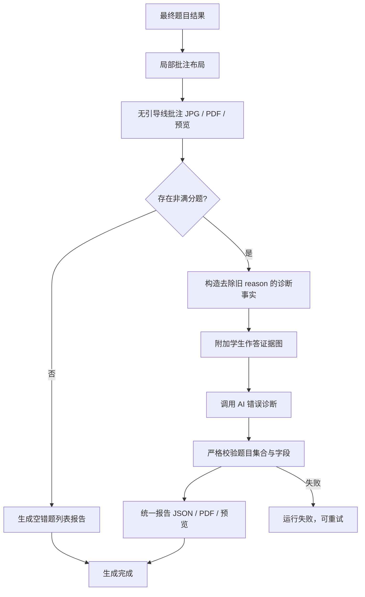

# 就近批注与 AI 错题诊断 Plan

## 架构概览

本次修改保留现有“最终评分 → 批注试卷 → 错题报告 → 完成”的生成物流，只调整两个内部阶段。

批注阶段使用局部候选布局：以学生答案证据框为中心，在有限距离内选择标记位置；候选均不合适时选择最近的页内位置，不再把标记移到页面远端，也不再产生引导线。

错题报告阶段拆为“构造诊断事实 → 调用模型 → 严格校验 → 组装报告 → 渲染 PDF”。模型看到原始题目与作答证据，以及去除了自然语言批改理由的结构化最终评分事实。经校验的模型诊断是逐题分析和总体分析的唯一来源；旧 `decisions_json.reason` 和固定题型建议不再参与报告内容生成。

## 核心数据结构

### AnnotationMark

- `mark_type`：`check`、`error_circle` 或 `partial_score`。
- `page_id`、`question_result_id`、`question_id`：归属信息。
- `box`：最终绘制框。
- `target_box`：错误圈对应的原始错误框，可为空。
- `label`、`color`：标记文本与颜色。

移除 `lead_line`。后端预览 JSON、共享前端契约和网页叠加渲染同步删除该字段，保证所有输出通道都无法再绘制引导线。

### ErrorAnalysisQuestionInput

- `questionId`、`questionNumber`、`questionType`：题目标识。
- `question`：完整题干。
- `standardAnswer`：最终评分所使用的标准答案快照。
- `studentResponse`：最终学生识别作答；填空题包含逐空作答，计算题包含按证据顺序整理的识别文本。
- `finalScore`、`maxScore`：只读最终分数。
- `gradingFacts`：评分点键对应的状态、得分、满分和依赖关系；不包含旧 `reason`。
- `rubricFacts`：评分配置中可供理解的判定标准；模型可据此把内部键转写为人可读能力描述。
- `teacherReviewFacts`：只包含最终教师复核事实；不得把它原样当作报告成文。
- `evidenceRegionIds`：随该题发送的学生作答证据标识。

### ErrorAnalysisQuestionOutput

- `questionId`：必须和输入题目一一对应。
- `errorCategory`：受控枚举，对应计算不认真、知识未掌握、方法未掌握、审题错误、表达书写、漏答不完整或证据不足。
- `errorReason`：结合学生作答指出首个关键偏差。
- `knowledgeGap`：需要补齐的具体知识或能力；证据不足时明确说明不能可靠确定。
- `masteredParts`：人可读的已掌握内容列表，不得使用内部评分点键。
- `suggestion`：与原因和知识薄弱点对应的可执行建议。

### ErrorAnalysisOutput

- `summary`：跨所有错题归纳的总体分析和优先改进方向。
- `questions`：`ErrorAnalysisQuestionOutput` 列表。

### ErrorQuestionFeedback / ErrorReportData

报告数据从 `ErrorAnalysisOutput` 转换而来。逐题字段改为 `errorCategory`、`errorReason`、`knowledgeGap`、`masteredParts`、`suggestion`，再补充现有题号、题型、分数和证据裁剪 ID。最终 JSON、接口预览与 PDF 共享该对象。

## 模块设计

### 局部批注布局

**文件：** `backend/homework_judge/artifacts/annotation_layout.py`

**职责：** 生成始终位于答案锚点附近且完整在页内的对勾与部分分标记。候选按答案右、左、上、下排序，并综合越界、与已有标记冲突、与其他受保护证据冲突和距锚点距离评分。必要时缩小标记；最终回退仍限制在锚点邻域。

**对外接口：** `build_question_marks(...) -> list[AnnotationMark]` 保持入口语义，`AnnotationMark` 不再包含 `lead_line`。

### 批注渲染

**文件：** `backend/homework_judge/artifacts/annotations.py`

**职责：** 按标记类型绘制对勾、错误圈和部分分标记。删除所有引导线绘制分支，继续保护学生原图与页面尺寸。

### 网页批注预览

**文件：** `shared/contracts.ts`、`client/src/features/grading/GradingPageOverlay.tsx`

**职责：** 共享契约移除 `lead_line`，SVG 叠加层删除 `<line>` 渲染。网页预览与下载 PDF 使用相同无连线语义。

### 错题诊断提示与校验

**文件：** `backend/homework_judge/artifacts/error_analysis.py`

**职责：**

- 定义诊断输入、受控错误类型和模型输出结构。
- 构造版本化系统提示词，明确模型不得改分、不得复制批改理由、不得把内部键输出给学生、不得无证据推断学习态度。
- 生成包含结构化事实及按题分组证据图片的多模态请求。
- 解析并严格校验 JSON，验证题目集合完全一致、无重复或未知题目、所有字段非空且长度受限。
- 把模型、网络和校验错误转换为可重试的、用户可理解的生成错误。

**对外接口：**

- `build_error_analysis_request(question_rows, region_rows, settings) -> ErrorAnalysisRequest`
- `analyze_errors(client, request) -> ErrorAnalysisOutput`

### 错题报告数据与渲染

**文件：** `backend/homework_judge/artifacts/error_report.py`

**职责：** 删除 `_plain_reason`、`_reviewed_reason`、`_knowledge_point` 和 `_suggestion` 等拼接逻辑。接收已经校验的 `ErrorAnalysisOutput`，按题目 ID 合并题号、分数和裁剪图，生成统一报告数据。PDF 更新逐题标签，避免呈现内部评分点键。

### 生成物编排

**文件：** `backend/homework_judge/artifacts/service.py`、`backend/homework_judge/jobs/grading_pipeline.py`

**职责：**

- 将同一个模型客户端注入生成物服务。
- 生成物服务改为可等待的异步流程：CPU/文件渲染仍在线程中执行，模型诊断在异步上下文调用。
- 扩展题目查询以取得学生最终识别文本及诊断所需事实。
- 非满分题存在时，先完成 AI 诊断再渲染报告；全满分时跳过模型。
- 任一诊断或结构校验失败时沿用现有 `failed + retryable` 状态机制，不写入伪造的错题报告。

## 模块交互



## 文件组织

```text
backend/homework_judge/artifacts/
├── annotation_layout.py       — 答案附近的确定性标记布局
├── annotations.py             — 无引导线的图片与 PDF 绘制
├── error_analysis.py          — AI 诊断输入、提示、调用与严格校验
├── error_report.py            — 诊断结果到 JSON/PDF 的组装与渲染
└── service.py                 — 异步生成物编排
backend/homework_judge/jobs/
└── grading_pipeline.py        — 注入模型并等待生成物流程
shared/
└── contracts.ts               — 无 lead_line 的预览契约
client/src/features/grading/
└── GradingPageOverlay.tsx     — 无 SVG 引导线的叠加预览
backend/tests/unit/
├── test_annotation_layout.py  — 邻近性、边界、冲突与标记回归
├── test_annotations.py        — 图片/PDF 无引导线渲染
├── test_error_analysis.py     — 提示输入、模型调用和严格校验
└── test_error_report.py       — AI 诊断报告组装与 PDF
backend/tests/integration/
└── test_grading_api.py        — 生成状态、失败重试和预览集成
tests/ui/
└── grading-workspace.test.tsx — 网页叠加预览无引导线
```

## 技术决策

| 决策点 | 选择 | 理由 |
|---|---|---|
| 标记布局 | 有界局部候选 + 最近位置回退 | 从数据结构上保证标记不会被移到远端边栏 |
| 引导线 | 后端模型、渲染器、共享契约和前端渲染全部删除 | 避免任何输出通道重新出现红线 |
| 错题分析来源 | 独立模型诊断 | 满足“重新分析原因”，避免旧批改文案拼接 |
| 模型输入 | 原始作答事实 + 证据图 + 去掉 reason 的结构化评分事实 | 给足诊断依据，同时切断复用旧自然语言结论的路径 |
| 模型调用粒度 | 每份报告一次批量调用 | 能归纳总体共性，且比逐题调用更少请求；输出仍按题严格校验 |
| 失败策略 | 明确失败并可重试 | 固定模板或旧 reason 回退会悄悄降低报告真实性 |
| 持久化 | 沿用报告 JSON 和 artifact preview | 本需求不需要新增可查询的长期诊断实体，避免数据库迁移 |
| 全满分场景 | 不调用模型 | 没有错题可诊断，减少无意义延迟和费用 |
| 生成编排 | 异步等待模型，渲染工作放到线程 | 与现有异步模型客户端一致，并避免阻塞事件循环 |
