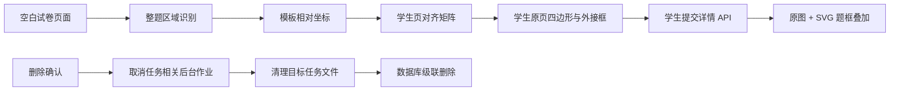

# 学生试卷整题区域展示与任务删除 Plan

> **已被部分取代（2026-08-09）：** 本文关于学生侧自动补算/扩张题框、缺页时继续识别、以答案框或外接框代表整题范围的规则，已由 [题框驱动的逐空识别与模型批改 Spec](../2026-08-09-question-frame-blank-grading-pipeline/spec.md) 取代。本文仅保留历史决策记录；新实现必须使用教师确认的完整题框集并对整批映射失败关闭。

## 架构概览

本次在现有“模板识别 → 学生页对齐 → 学生作答识别”链路上增加一条整题区域数据流。空白试卷识别阶段产出每题的完整模板区域；学生试卷处理阶段复用已有单应性变换，把模板区域映射成学生原页上的四边形和外接框，并与原始学生页一起持久化。前端使用与原图同尺寸坐标系的 SVG 叠加层绘制四边形，因此浏览器缩放不会改变题框相对位置。

历史任务通过独立的题目区域补全作业处理：先补齐模板区域，再使用已有学生页对齐矩阵为历史学生提交生成原页区域，不重新识别学生答案。

任务删除使用受控的异步删除接口。接口先取消任务识别、学生处理和区域补全作业，等待取消完成，再清理目标任务目录并通过数据库级联删除任务记录。前端只在教师确认永久删除后调用接口。



## 核心数据结构

### TemplateQuestionRegion

表示空白试卷上整道题的一个区域片段：

- `pageNumber`：模板页码。
- `x`、`y`、`width`、`height`：相对于模板页面宽高的 0～1 坐标。
- `confidence`：区域定位置信度，范围 0～1。
- `issues`：裁切、跨页、边界不确定等可读问题。

`questions` 增加 `question_regions_json`，保存有顺序的 `TemplateQuestionRegion` 数组。跨页题和同页不连续题通过多个数组元素表达。

### StudentQuestionRegion

表示一个模板题目片段映射到学生原始页面后的持久化结果：

- `id`：区域标识。
- `submissionId`、`questionId`：所属学生提交和题目。
- `sortOrder`：同一题内的区域顺序。
- `templatePageId`、`studentPageId`：模板页和学生原页引用。
- `templateBox`：模板页面上的归一化矩形。
- `studentPolygon`：学生原页像素坐标中的四个顶点。
- `studentBox`：四边形在学生原页上的可见外接框。
- `status`：`aligned` 或 `needs_review`。
- `issues`：模板区域和页面对齐产生的问题。

新增 `student_question_regions` 表，使用 `(submission_id, question_id, sort_order)` 唯一约束。区域引用 `student_pages`，学生提交重跑或删除时随原页一起级联清理。

### QuestionRegionState

学生提交增加独立的题目区域状态，避免改变已有作答识别状态：

- `status`：`pending`、`processing`、`ready`、`needs_review` 或 `failed`。
- `errorCode`、`errorMessage`：补全失败信息。
- `missingQuestionIds`：详情接口根据模板与已映射区域计算出的缺失题目列表。

历史学生提交迁移后默认为 `pending`。新提交在学生处理流水线中同步生成题目区域；旧提交由区域补全作业更新。

### StudentSubmissionDetail 扩展

详情响应在现有 `pages` 和 `responses` 之外增加：

- `questionRegionState`：区域处理状态、错误和缺失题目。
- `questionRegions`：`StudentQuestionRegion` 数组。

前端不从答题区域推算整题框，也不从裁剪图恢复坐标。

## 核心接口

### 模板区域识别

- 新任务的试卷结构识别响应同时包含 `questionRegions` 与现有 `answerRegions`。
- 历史任务补全使用稳定的题目 ID、题号和题干作为提示，只返回请求题目的完整区域。
- 解析层校验页码、数值范围、正面积和置信度；非法区域被丢弃并记录问题，不进入持久化。

### 区域映射

`map_question_region(region, alignment)` 接收模板归一化矩形和页面对齐结果，输出学生原页像素四边形、裁剪到页面可见范围后的外接框以及质量状态。它只做几何映射，不生成或保存裁剪图片。

### 学生区域补全

`POST /tasks/{taskId}/question-regions/process` 启动或复用一个任务级补全作业，返回 `202`。作业流程为：

1. 找出缺少整题区域的题目并从已保存的空白试卷页面补齐。
2. 对任务下已有学生提交读取持久化对齐矩阵。
3. 为每份学生提交原子替换 `student_question_regions`。
4. 更新各提交的题目区域状态和问题信息。

学生提交页面在发现状态为 `pending` 时调用该接口，并轮询现有学生列表和详情接口。重复调用复用同一个后台作业。

### 学生提交接口

- `GET /tasks/{taskId}/student-submissions` 保留现有列表能力，并返回题目区域状态摘要。
- `GET /student-submissions/{submissionId}` 返回原始页面、整题区域、区域处理状态和现有作答识别结果。
- 新学生提交的主流水线在保存对齐结果时同步保存整题区域，避免额外后台调用。

### 任务删除接口

`DELETE /tasks/{taskId}`：

1. 校验任务存在并查询其学生提交 ID。
2. 精确取消任务识别键、该任务的区域补全键及所有学生提交处理键，并等待完成。
3. 使用受限路径解析逐个清理 `uploads`、`pages` 和 `tmp` 下的目标任务目录；清理失败时返回错误，不报告成功。
4. 在事务中删除 `tasks` 记录，由外键级联删除文档、页面、题目、学生提交和区域数据。
5. 返回 `{taskId, deleted: true}`。

`JobManager` 增加按精确键集合取消并等待的方法。删除操作不使用模糊前缀，也不会取消其他任务的作业。

## 模块设计

### 数据库迁移

**职责：** 新增模板整题区域字段、学生整题区域表和学生区域处理状态；保证现有 v4 数据库可幂等升级。

**依赖：** SQLite 外键和现有任务/题目/学生页面表。

### 识别与规范化

**职责：** 在新任务识别和历史补全两条路径中生成完整题目区域；按题目 ID 合并多页结果；拒绝无效框。

**依赖：** 现有视觉模型客户端、试卷页面、题目结构和批次合并逻辑。

### 几何映射与学生流水线

**职责：** 将模板矩形映射为学生原页四边形；保留原页像素坐标；在学生处理成功提交时与页面、作答记录一起原子落库。

**依赖：** 现有双向单应性变换、学生页面尺寸和模板页面尺寸。

### 历史区域补全作业

**职责：** 为旧任务补模板整题区域，并为已有学生提交回填原页区域；单个学生失败时记录明确状态，不伪造框。

**依赖：** 识别服务、几何映射、数据库和后台作业管理器。

### 学生试卷前端

**职责：** 提供学生提交上传、列表、状态轮询、失败重试、页码切换和原图题框展示。

页面主区域使用一个与图片自然尺寸一致的容器。学生原图和 SVG 共用相同宽高与缩放比例；SVG 设置以原页宽高为坐标系的 `viewBox`，使用 `polygon` 绘制区域并放置题号标签。点击题框或题号时仅改变选中样式，不显示正确或错误语义。

### 任务删除前端

**职责：** 在任务卡片提供独立删除按钮，展示可访问的永久删除确认对话框，调用删除接口并刷新任务列表。

任务卡片不使用包含按钮的嵌套链接结构。删除请求期间禁用重复提交；成功后关闭对话框并使任务查询失效，失败时保留任务并展示错误。

## 模块交互

### 新学生提交

1. 前端上传学生试卷。
2. 后端渲染学生原页并与模板页对齐。
3. 后端读取或补齐模板完整题目区域。
4. 几何映射生成学生原页四边形与外接框。
5. 页面、作答结果和整题区域在一次提交中切换为新版本。
6. 前端轮询到 `ready` 后加载详情并绘制题框。

### 历史学生提交

1. 前端读取详情并发现题目区域状态为 `pending`。
2. 前端触发任务级区域补全接口。
3. 后端补齐模板区域，并使用历史对齐矩阵映射各学生原页。
4. 前端轮询状态，完成后刷新详情并显示区域；失败或缺失时显示文字提示。

### 删除任务

1. 教师点击任务卡片上的删除按钮。
2. 前端展示永久删除范围，教师确认。
3. 后端取消并等待目标任务相关作业。
4. 后端清理受限任务目录并级联删除数据库记录。
5. 前端刷新任务列表。

## 文件组织

```text
backend/homework_judge/
├── alignment/regions.py                 # 整题矩形到学生原页多边形的映射
├── api/submissions.py                   # 学生列表、详情与区域补全入口
├── api/tasks.py                         # 永久删除任务接口
├── db/database.py                       # v5 迁移与新增表
├── files/storage.py                     # 严格、受限的任务目录清理
├── jobs/manager.py                      # 精确取消并等待多个作业
├── jobs/question_region_pipeline.py     # 历史模板与学生区域补全
├── jobs/student_pipeline.py             # 新提交同步保存整题区域
├── recognition/normalizer.py            # 整题区域坐标规范化
├── recognition/parser.py                # 整题区域响应解析
├── recognition/prompts.py               # 新任务与历史补框提示
├── recognition/service.py               # 整题区域识别接口
└── schemas.py                            # 区域请求/响应模型

client/src/
├── components/ConfirmDeleteTaskDialog.tsx
├── features/students/StudentPageOverlay.tsx
├── features/students/StudentSubmissionsPage.tsx
├── features/tasks/TaskListPage.tsx
├── lib/api.ts
├── main.tsx
└── styles.css

shared/contracts.ts

backend/tests/
├── integration/test_student_submission_api.py
├── integration/test_task_delete_api.py
├── unit/test_database.py
├── unit/test_job_manager.py
├── unit/test_question_regions.py
└── unit/test_student_pipeline.py

tests/ui/
├── student-page-overlay.test.tsx
├── student-submissions-page.test.tsx
└── task-delete.test.tsx
```

## 技术决策

| 决策点 | 选择 | 理由 |
|---|---|---|
| 整题区域来源 | 空白模板识别后映射 | 同一任务只识别一次，所有学生共享稳定题框 |
| 模板坐标 | 0～1 归一化矩形 | 与模板渲染分辨率解耦，兼容现有答题区域格式 |
| 学生坐标 | 原页像素四边形 + 外接框 | 四边形保留透视形变，外接框便于命中和辅助信息展示 |
| 前端叠加方式 | 与原图共用 `viewBox` 的 SVG | 浏览器响应式缩放时无需手动测量每个框，且支持倾斜四边形 |
| 历史数据 | 独立后台补全，不重新识别学生答案 | 降低模型调用和数据破坏风险 |
| 新提交持久化 | 与学生页面和作答结果原子提交 | 失败重跑不会留下半套区域或删除旧结果 |
| 区域质量表达 | 中性选中色 + 文字状态 | 本阶段不表达批改对错，符合无障碍要求 |
| 后台停止 | 按精确作业键取消并等待 | 避免删除后仍有作业写入，也不误停其他任务 |
| 删除方式 | 二次确认后的永久删除 | 符合已确认范围，不引入回收站和软删除状态 |
| 文件安全 | 解析并验证任务目录必须位于数据子目录 | 防止任务 ID 或路径异常扩大删除范围 |
