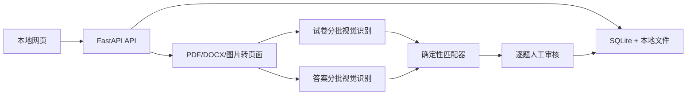
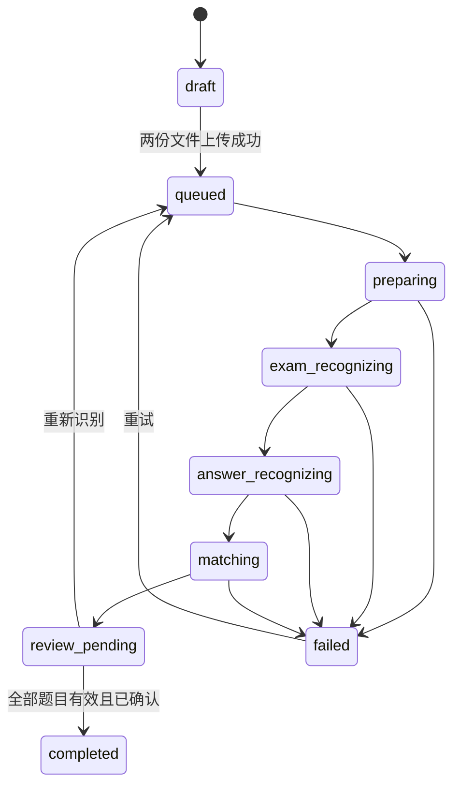
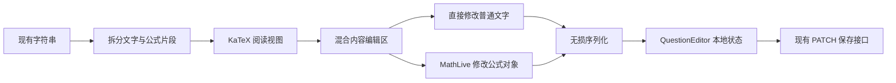
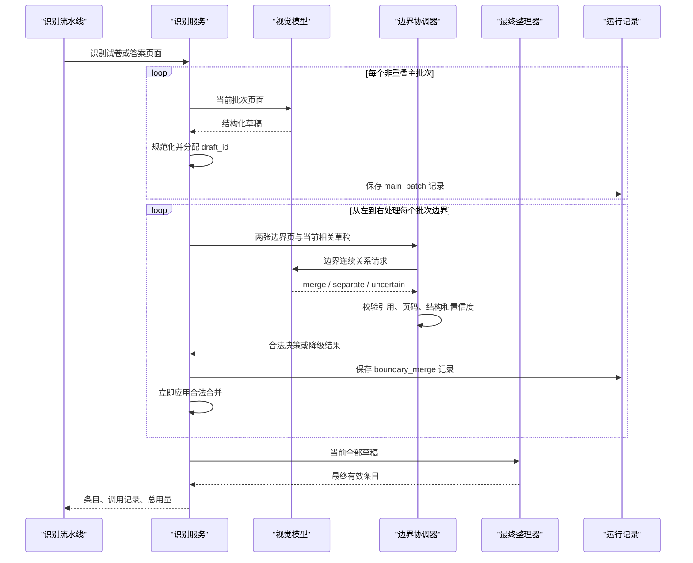
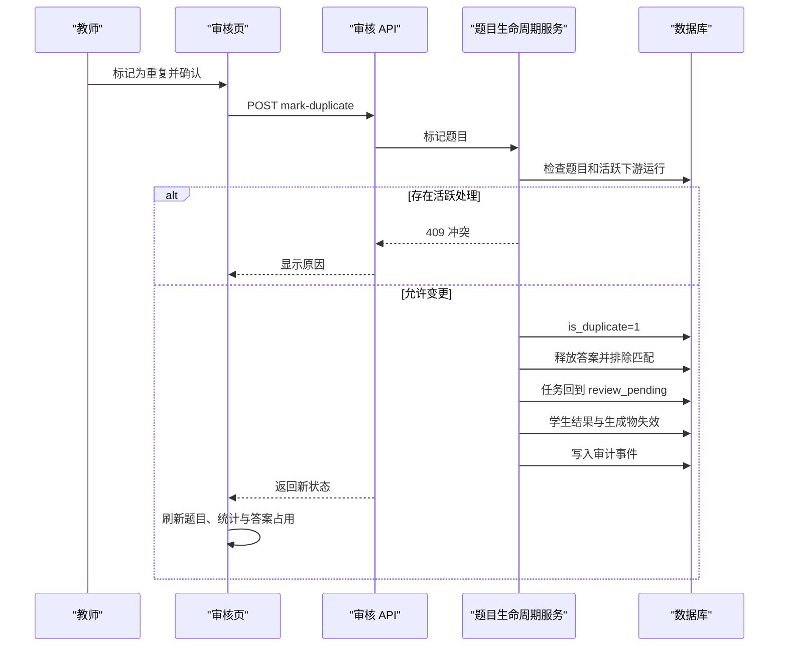

# 试卷题目识别与参考答案匹配 Plan

## 架构概览

系统采用本地单机 Web 架构：

- React + TypeScript 前端负责上传、进度展示、原文件预览和逐题审核。
- FastAPI 后端负责文件校验与存储、文档转图、百炼调用、结构解析、自动匹配、审核保存和完成准入。
- SQLite 保存任务、文件、运行记录、原始识别条目、匹配建议和人工覆盖。
- 文件系统保存上传原件与派生页面图像。
- 后台流水线按“页面准备 → 题目识别 → 答案识别 → 匹配”顺序运行，前端轮询任务状态。



前端开发期间由 Vite 提供热更新并代理 `/api`；生产模式由 FastAPI 同时提供 `/api` 和构建后的静态页面，浏览器只需要访问一个本地端口。

## 技术栈

### 后端

- Python 3.12
- FastAPI、Uvicorn、Pydantic Settings
- aiosqlite 管理 SQLite
- httpx 调用百炼 OpenAI 兼容接口
- pypdfium2 渲染 PDF
- Pillow 处理 JPG/PNG、方向和缩放
- LibreOffice headless 把 DOCX 转成 PDF，再走统一 PDF 渲染链路
- RapidFuzz 计算规范化题干相似度
- pytest、pytest-asyncio、Ruff、mypy

### 前端

- React、TypeScript、Vite
- TanStack Query 管理请求、轮询和缓存
- React Hook Form 管理编辑表单
- Zod 校验 API 数据
- Lucide React 提供图标
- Vitest、Testing Library

依赖必须固定到明确版本并提交锁文件，不使用 `latest`。

## 核心数据结构

### RecognitionTask

| 字段 | 类型 | 说明 |
| --- | --- | --- |
| id | UUID 字符串 | 任务标识 |
| title | 字符串 | 默认由试卷文件名生成，可编辑 |
| status | 枚举 | draft、queued、preparing、exam_recognizing、answer_recognizing、matching、review_pending、completed、failed |
| active_run_id | 可空 UUID | 当前处理运行 |
| last_error_code | 可空字符串 | 最近失败错误码 |
| last_error_message | 可空字符串 | 面向用户的错误摘要 |
| created_at / updated_at | 时间 | 创建与更新时间 |

### StoredDocument

| 字段 | 类型 | 说明 |
| --- | --- | --- |
| id | UUID 字符串 | 文件标识 |
| task_id | UUID 字符串 | 所属任务 |
| role | exam / answer | 试卷或参考答案 |
| original_name | 字符串 | 原始文件名 |
| stored_name | 字符串 | 随机安全文件名 |
| mime_type | 字符串 | 经过内容探测后的类型 |
| extension | 字符串 | 规范化扩展名 |
| size_bytes | 整数 | 文件大小 |
| sha256 | 字符串 | 内容摘要 |
| page_count | 可空整数 | 页面数 |
| relative_path | 字符串 | 相对数据目录路径 |
| created_at | 时间 | 上传时间 |

### DocumentPage

| 字段 | 类型 | 说明 |
| --- | --- | --- |
| id | UUID 字符串 | 页面标识 |
| document_id | UUID 字符串 | 所属文件 |
| page_number | 正整数 | 从 1 开始的原始页码 |
| image_path | 字符串 | 派生 JPEG 相对路径 |
| width / height | 正整数 | 图像尺寸 |
| sha256 | 字符串 | 页面图像摘要 |

### ProcessingRun

| 字段 | 类型 | 说明 |
| --- | --- | --- |
| id | UUID 字符串 | 运行标识 |
| task_id | UUID 字符串 | 所属任务 |
| kind | 枚举 | full_pipeline、exam_recognition、answer_recognition、matching |
| status | 枚举 | queued、running、succeeded、failed、interrupted |
| stage | 字符串 | 当前子阶段 |
| progress_current / progress_total | 整数 | 可观察进度 |
| model_id | 可空字符串 | 实际模型 |
| prompt_version | 可空字符串 | 提示词版本 |
| request_summary_json | JSON | 不含密钥和图片数据的请求摘要 |
| raw_response_json | 可空 JSON | 模型原始响应 |
| usage_json | 可空 JSON | Token 用量 |
| error_code / error_message | 可空字符串 | 失败信息 |
| started_at / finished_at | 可空时间 | 生命周期时间 |

### QuestionDraft

| 字段 | 类型 | 说明 |
| --- | --- | --- |
| id | UUID 字符串 | 题目标识 |
| task_id / source_run_id | UUID 字符串 | 所属任务与来源运行 |
| sort_order | 整数 | 试卷顺序 |
| detected_number | 字符串 | 模型原始题号 |
| normalized_number | 字符串 | 本地规范化题号 |
| stem | 字符串 | 完整题干 |
| options_json | JSON 数组 | 选项标识与内容 |
| question_type | 枚举 | single_choice、multiple_choice、fill_blank、calculation、short_answer、unknown |
| score | 可空小数 | 题目分值 |
| source_pages_json | JSON 数组 | 来源页码 |
| confidence | 0-1 小数 | 识别置信度 |
| issues_json | JSON 数组 | 缺字段、跨页、重复号等问题 |
| teacher_override_json | 可空 JSON | 教师对字段的覆盖 |
| confirmation_status | pending / confirmed | 教师确认状态 |

### AnswerEntry

| 字段 | 类型 | 说明 |
| --- | --- | --- |
| id | UUID 字符串 | 答案条目标识 |
| task_id / source_run_id | UUID 字符串 | 所属任务与来源运行 |
| sort_order | 整数 | 答案文件顺序 |
| number_hint / normalized_number | 字符串 | 原题号提示与规范化值 |
| stem_hint | 可空字符串 | 解析版中重复的题干 |
| answer | 字符串 | 标准答案 |
| explanation | 字符串 | 解析，可为空 |
| source_pages_json | JSON 数组 | 来源页码 |
| confidence | 0-1 小数 | 识别置信度 |
| issues_json | JSON 数组 | 缺答案、重复号等问题 |

### QuestionAnswerMatch

| 字段 | 类型 | 说明 |
| --- | --- | --- |
| id | UUID 字符串 | 匹配标识 |
| task_id / question_id | UUID 字符串 | 所属任务与题目 |
| answer_entry_id | 可空 UUID | 选中的原始答案条目 |
| method | 枚举 | number_exact、stem_similarity、manual、direct_entry、unmatched |
| number_score | 0-1 小数 | 题号信号 |
| stem_score | 0-1 小数 | 题干信号 |
| order_score | 0-1 小数 | 顺序信号 |
| total_score | 0-1 小数 | 综合置信度 |
| reasons_json | JSON 数组 | 可展示的匹配依据与冲突 |
| status | suggested、needs_review、confirmed | 当前状态 |
| teacher_answer | 可空字符串 | 教师直接填写的答案 |
| teacher_explanation | 可空字符串 | 教师直接填写的解析 |
| updated_at | 时间 | 更新时间 |

原始 QuestionDraft、AnswerEntry 和自动匹配信号不可被人工编辑覆盖；UI 展示“有效值”时再叠加 teacher_override 和 teacher_answer。

## 状态机



服务启动时将 `queued` 以外的处理中状态及其 running 运行标记为 `interrupted`，任务转为 `failed` 并提供重试，不自动重复产生模型费用。

## 文件处理设计

### 上传校验

1. 按流式方式写入任务专属临时文件，边写边计算 SHA-256 和大小。
2. 校验允许扩展名，并检查文件签名字节：
   - PDF：`%PDF-`
   - DOCX：ZIP 容器且包含 `[Content_Types].xml` 与 `word/document.xml`
   - JPG：JPEG 文件签名并能被 Pillow 解码
   - PNG：PNG 文件签名并能被 Pillow 解码
3. 校验成功后原子移动到 `data/uploads/<task_id>/<role>/`。
4. 文件名仅用于展示；磁盘名使用 UUID，路径由服务端生成。

### 页面准备

- PDF：用 pypdfium2 获取页数并逐页渲染。
- DOCX：在隔离的临时目录调用 LibreOffice headless 转 PDF；转换产物再进入 PDF 流程。
- JPG/PNG：应用 EXIF 旋转、透明背景铺白，并作为单页文档处理。
- 页面统一为 RGB JPEG，最长边和总像素受配置限制，默认适配约 1800×2400 画布，不放大小图。
- 每页单独保存，模型输入使用服务端读取后生成的 Data URL，不把 Data URL 写入数据库。
- 临时转换目录无论成功失败都清理；上传原件和正式页面保留。

## 视觉识别设计

### 模型客户端

- 使用百炼 OpenAI 兼容 `/chat/completions` 接口。
- 默认模型配置为 `qwen3-vl-plus`，可通过 `DASHSCOPE_MODEL` 更换。
- Base URL、Workspace 域名、API Key、超时和重试次数均来自服务端环境变量。
- 请求使用低温度和 JSON 输出约束；提示词明确禁止解题、补写缺失内容或直接做跨文件匹配。
- 保存模型、提示词版本、页码批次、响应和用量；请求摘要只记录图片页码、数量和字节数。

### 分批与跨页

- 每次发送最多 4 页，同一文档相邻批次重叠 1 页。
- 提示模型为每个条目返回来源页码、是否从上一页延续、是否在下一页继续。
- 批次解析后按“规范化题号＋题干指纹”合并重叠页重复项。
- 同号但题干明显不同的条目不合并，分别保留并标记 `duplicate_number`。
- 题目跨批次且字段互补时只做字段合并，不允许以模型常识补齐缺失公式或答案。

### 试卷结构输出

```json
{
  "questions": [
    {
      "number": "1",
      "stem": "题干",
      "options": [{"label": "A", "text": "选项内容"}],
      "type": "single_choice",
      "score": 3,
      "sourcePages": [1],
      "confidence": 0.96,
      "issues": []
    }
  ]
}
```

### 答案结构输出

```json
{
  "answers": [
    {
      "numberHint": "1",
      "stemHint": "解析版中存在时返回，否则为空",
      "answer": "A",
      "explanation": "解析内容",
      "sourcePages": [1],
      "confidence": 0.97,
      "issues": []
    }
  ]
}
```

### 容错解析

- 接受纯 JSON、Markdown JSON 代码块、JSON 前后少量说明以及对象/数组根节点。
- 每个节点独立归一化和校验；一个坏节点不能使已合法节点丢失。
- 不执行 `eval` 或其他字符串求值。
- 无任何可用节点时该识别阶段失败；存在部分可用节点时进入审核并显示遗漏。
- 原始模型内容、局部解析问题和归一化记录分别保存。

## 题号规范化

`normalize_question_number` 执行以下确定性规则：

1. Unicode NFKC 规范化、去除多余空白。
2. 去除“第”“题”和结尾的 `.`、`．`、`、`、`:`。
3. 把全角数字转半角，把中文整数题号转换为阿拉伯数字。
4. 保留层级，例如 `1（2）`、`1-2`、`1.2` 统一为可比较的 `1.2`。
5. 不把无法确定的字母编号或章节序号强行转换为题号。

原始题号始终保留。重复规范化题号会在题目和答案两侧分别形成冲突组。

## 自动匹配算法

匹配输入只使用已经保存的 QuestionDraft 与 AnswerEntry，不再次调用模型。

### 第一步：唯一题号匹配

- 某规范化题号在题目侧和答案侧都恰好出现一次时，建立 `number_exact` 建议。
- 答案内容非空且双方识别置信度不低于配置阈值时，总置信度至少为 0.90。
- 任一侧同号重复时不做题号自动匹配，所有相关条目标记冲突。

### 第二步：题干候选匹配

- 只处理未匹配且 `stem_hint` 非空的答案条目。
- 题干先去除空白、常见标点、题号前缀和格式噪声，保留数字、单位、变量和选项文本。
- 使用 RapidFuzz 组合 token-set 与字符序列相似度。
- 综合分数：
  - 题号兼容信号：55%
  - 题干/选项相似度：35%
  - 相对顺序接近度：10%
- 无题号时题干相似度必须不低于 0.82，且第一候选比第二候选至少高 0.08，才生成 `stem_similarity` 建议。

### 第三步：一对一约束与异常

- 一条 AnswerEntry 最多分配给一道 QuestionDraft。
- 候选按综合分数、题干分数、稳定 ID 顺序确定性排序。
- 若多个候选竞争同一条答案且没有明显领先者，全部保持未匹配并记录 `candidate_conflict`。
- 没有候选的题目标记 `answer_missing`；未使用答案条目标记 `orphan_answer`。
- 自动结果只产生 `suggested` 或 `needs_review`，从不直接产生 `confirmed`。

### 人工覆盖

- 选择现有答案条目时，服务端再次验证一对一约束。
- 若选中的答案已被其他题使用，必须先明确解除旧关系，不能静默抢占。
- 直接填写答案时生成 `direct_entry` 匹配，不修改任何 AnswerEntry。
- 人工操作保留操作者显示名、时间、变更前后值和原因。

## 完成准入

任务满足以下全部条件时才能从 `review_pending` 进入 `completed`：

- 至少存在一道题。
- 每道题都有非空题号、题干、合法题型和非空标准答案。
- 每道题都不存在阻塞级解析问题或匹配冲突。
- 每道题的匹配状态为 `confirmed`。
- 没有处于“待处理”的未使用答案条目；教师可把确认为无关内容的条目标记为忽略。

前端按钮状态只是提示，最终准入必须由后端事务内验证。

## API 设计

所有响应使用 `{ "data": ..., "error": null }` 或 `{ "data": null, "error": { "code": ..., "message": ..., "details": ... } }`。

| 方法 | 路径 | 用途 |
| --- | --- | --- |
| GET | `/api/health` | 服务、数据库、模型配置状态 |
| GET | `/api/tasks` | 最近任务列表 |
| POST | `/api/tasks` | 以 multipart 创建任务并上传 exam、answer |
| GET | `/api/tasks/{task_id}` | 任务、文档、进度和汇总 |
| POST | `/api/tasks/{task_id}/process` | 启动或重试完整流水线 |
| GET | `/api/tasks/{task_id}/progress` | 轻量轮询状态 |
| GET | `/api/tasks/{task_id}/review` | 题目、答案条目、匹配和异常 |
| PATCH | `/api/questions/{question_id}` | 保存题目字段人工覆盖 |
| PATCH | `/api/matches/{match_id}` | 选择/解除答案，或保存直接答案与解析 |
| POST | `/api/questions/{question_id}/confirm` | 确认单题 |
| POST | `/api/questions/{question_id}/reopen` | 取消确认 |
| POST | `/api/answer-entries/{entry_id}/ignore` | 标记无关答案条目 |
| POST | `/api/tasks/{task_id}/complete` | 执行服务端完成准入 |
| GET | `/api/tasks/{task_id}/runs` | 运行历史 |
| GET | `/api/runs/{run_id}` | 原始响应、解析问题和用量 |
| GET | `/api/files/{file_id}` | 安全读取上传原件 |
| GET | `/api/pages/{page_id}` | 安全读取派生页面 |

创建任务时两份文件必须都通过校验才提交；任一文件失败则清理本次临时文件，不留下半成品任务。

## 前端模块设计

### TaskListPage

- 展示最近任务、状态、题目数、待处理数和更新时间。
- 提供“新建识别任务”和重新打开入口。

### CreateTaskPage

- 两个明确区分的上传区：试卷、参考答案。
- 显示支持格式、大小限制、文件名和本地校验错误。
- 上传成功后自动进入任务页并启动处理。

### ProcessingPage

- 显示四个阶段和页级/批次级进度。
- 轮询进行中状态，离开再返回不会丢失进度。
- 失败时显示阶段、错误码、可理解原因和重试按钮。

### ReviewPage

- 桌面端三栏：题目导航、当前题审核表单、原文件页面预览。
- 顶部显示已确认、待确认、冲突、缺答案和孤立答案计数。
- 当前题卡展示自动值与人工有效值，置信度旁显示具体依据。
- 答案选择器只列出未使用条目，并允许查看候选条目来源页。
- 单题保存与确认分离；修改已确认题会自动回到待确认。
- 独立的未匹配/被忽略答案面板，避免答案静默丢失。

### FilePreview

- PDF 原件可直接嵌入预览；DOCX 和图片使用服务端生成的页面图像。
- 支持按识别来源页跳转，显示“试卷/答案”和页码。
- 预览失败不阻止编辑，但必须给出明确提示。

## 后台任务与并发

- 使用进程内异步任务管理器执行首版流水线，但所有状态先写数据库再排队。
- 同一 task_id 使用互斥锁；重复启动返回当前运行而不是创建重复调用。
- 模型批次并发默认 2，可配置；题目和答案两个阶段顺序执行，以便进度清晰。
- 服务关闭时停止接受新任务，等待短暂宽限期后把未完成运行保留为可恢复记录。
- 多进程部署不在首版范围内，生产启动固定为单进程。

## 数据库与审计

- 使用显式 SQL 迁移和 `PRAGMA foreign_keys=ON`。
- SQLite 使用 WAL 模式；写操作使用短事务。
- 审计事件至少包括：task_created、files_uploaded、processing_started、stage_failed、stage_retried、question_edited、match_changed、question_confirmed、question_reopened、answer_ignored、task_completed。
- 审计 payload 使用字段白名单，禁止保存密钥、Data URL、授权头和完整文件路径。

## 配置

| 环境变量 | 默认值 | 说明 |
| --- | --- | --- |
| `APP_DATA_DIR` | `./data/runtime` | 运行数据根目录，与样本目录分开 |
| `DATABASE_PATH` | `<APP_DATA_DIR>/homework-judge.sqlite` | SQLite 文件 |
| `PORT` | `8787` | 本地端口 |
| `DASHSCOPE_API_KEY` | 无 | 必填的百炼 API Key |
| `DASHSCOPE_BASE_URL` | 百炼北京兼容地址 | 可替换为 Workspace 专属域名 |
| `DASHSCOPE_MODEL` | `qwen3-vl-plus` | 视觉模型 |
| `MODEL_TIMEOUT_MS` | `120000` | 单次请求超时 |
| `MODEL_RETRY_COUNT` | `2` | 临时错误额外重试次数 |
| `MODEL_CONCURRENCY` | `2` | 模型批次并发 |
| `MODEL_PAGES_PER_BATCH` | `4` | 单批页面数 |
| `ANSWER_PAGES_PER_BATCH` | `3` | 答案单批页数，相邻批次重叠一页 |
| `MAX_UPLOAD_MB` | `30` | 单文件上限 |
| `MAX_DOCUMENT_PAGES` | `30` | 单文件页数上限 |
| `AUTO_MATCH_THRESHOLD` | `0.82` | 题干建议阈值 |
| `AUTO_MATCH_MARGIN` | `0.08` | 第一、第二候选最小差距 |
| `TEACHER_NAME` | `本机教师` | 审计显示名 |

`.env.example` 只包含占位说明，绝不包含真实密钥。

## 文件组织

```text
homework_judge/
├── .env.example
├── .gitignore
├── README.md
├── package.json
├── pnpm-lock.yaml
├── pyproject.toml
├── requirements.lock
├── vite.config.ts
├── tsconfig.json
├── backend/
│   ├── run_server.py
│   ├── homework_judge/
│   │   ├── main.py
│   │   ├── config.py
│   │   ├── errors.py
│   │   ├── schemas.py
│   │   ├── api/
│   │   │   ├── router.py
│   │   │   ├── tasks.py
│   │   │   ├── review.py
│   │   │   ├── runs.py
│   │   │   └── files.py
│   │   ├── db/
│   │   │   ├── database.py
│   │   │   ├── migrations.py
│   │   │   └── repositories.py
│   │   ├── files/
│   │   │   ├── storage.py
│   │   │   ├── validation.py
│   │   │   └── renderer.py
│   │   ├── recognition/
│   │   │   ├── client.py
│   │   │   ├── prompts.py
│   │   │   ├── parser.py
│   │   │   ├── normalizer.py
│   │   │   └── service.py
│   │   ├── matching/
│   │   │   ├── numbers.py
│   │   │   ├── similarity.py
│   │   │   └── matcher.py
│   │   └── jobs/
│   │       ├── manager.py
│   │       └── pipeline.py
│   └── tests/
│       ├── fixtures/
│       ├── unit/
│       └── integration/
├── client/
│   ├── index.html
│   └── src/
│       ├── main.tsx
│       ├── app/
│       ├── components/
│       ├── features/tasks/
│       ├── features/processing/
│       ├── features/review/
│       ├── lib/
│       └── styles.css
├── shared/
│   ├── contracts.ts
│   └── schemas.ts
├── tests/
│   ├── setup.ts
│   └── ui/
└── scripts/
    ├── clean-build.mjs
    └── visual-check.mjs
```

## 技术决策

| 决策点 | 选择 | 理由 |
| --- | --- | --- |
| 文件理解 | 统一渲染为页面图像后调用视觉模型 | 样本含公式和示意图，文本层不完整 |
| DOCX 处理 | LibreOffice 转 PDF，再统一渲染 | 最大程度保留 Word 布局，不重复实现排版引擎 |
| 模型接入 | 百炼 OpenAI 兼容接口 | 接口成熟、模型可配置，密钥完全留在服务端 |
| 模型职责 | 分别抽取结构，不直接跨文件配对 | 降低长上下文错配风险，便于追踪和重试 |
| 长文档策略 | 4 页批次、1 页重叠、本地去重 | 兼顾跨页题目、输出稳定性和调用成本 |
| 匹配方式 | 本地确定性规则与模糊相似度 | 可解释、可测试、重复运行稳定，不产生额外模型费用 |
| 不确定结果 | 建议但不自动确认 | 完成结果以人工可核对为准 |
| 持久化 | SQLite + 本地文件 | 符合 Windows 单机首版，部署和备份简单 |
| 后台任务 | 单进程进程内任务 + 数据库状态 | 首版足够简单，同时避免 HTTP 长连接超时 |
| 人工修改 | 覆盖层，不改原始识别数据 | 保留可追溯性，支持比较自动结果和最终结果 |

## Spec 覆盖

| Spec | 设计归属 |
| --- | --- |
| F1-F3 | CreateTaskPage、上传 API、StoredDocument、文件存储 |
| F4 | 文件处理与 DocumentPage |
| F5-F8 | Recognition 服务、ProcessingRun、容错解析 |
| F9-F11 | 题号规范化、Matcher、QuestionAnswerMatch |
| F12 | 状态机、后台任务、ProcessingPage |
| F13-F15 | ReviewPage、人工覆盖、完成准入 |
| F16-F18 | 运行历史、审计、重试和启动恢复 |

## 增量实施方案：公式显示与无门槛编辑

### 方案比较与技术选择

#### 方案 A：KaTeX 阅读渲染 + MathLive 单公式可视化编辑 + 本地混合内容编排（采用）

- 使用 KaTeX 把识别文本中的公式片段渲染为行内或独立公式，并在严格的非信任模式下禁用可加载外部资源的命令。
- 使用 MathLive 的 `math-field` 提供所见即所得的单公式编辑和数学虚拟键盘；教师只操作排版后的公式，不接触 LaTeX。
- 项目自行维护“普通文字片段 / 公式片段”的有序结构：普通文字直接输入，公式片段调用 MathLive 编辑，保存时再无损序列化为现有字符串格式。
- 优点：不改后端接口；阅读渲染稳定；公式输入能力完整；实现范围可控制；异常公式可逐段降级。
- 代价：前端同时增加两个本地依赖，并需要自行实现混合片段的拆分、合并和光标插入位置管理。

#### 方案 B：只使用 MathLive 处理整个字段（不采用）

- 把题干、答案或解析整体放进一个数学输入框，并用数学文本命令容纳中文。
- 优点：依赖少、编辑器现成。
- 缺点：MathLive 的核心对象是公式输入框，不适合长篇中文、自然段和多公式混排；普通文字编辑体验与当前页面差异过大。

#### 方案 C：引入完整富文本编辑器并开发公式节点（暂不采用）

- 使用富文本框架管理段落、选区和内联公式节点，再把 MathLive 嵌入自定义公式节点。
- 优点：混排编辑体验最接近 Word，后续可扩展图片、表格等复杂内容。
- 缺点：依赖和实现显著增多，需要额外处理富文本 JSON 与现有纯字符串之间的兼容、粘贴清洗、历史数据迁移和编辑器状态；超出本次公式修复范围。

#### 选择结论

采用方案 A。阅读态与编辑态分离：阅读态优先保证所有历史内容稳定显示；点击“编辑”后，字段被拆为普通文字与公式片段，教师直接修改文字，点击公式片段后在可视化公式面板中修改。保存结果仍是现有 `$...$` / `$$...$$` 字符串，因此后端、数据库和历史任务无需迁移。

KaTeX 和 MathLive 均通过包管理器固定版本并打入本地构建产物，不使用 CDN。MathLive 的字体和必要资源复制到生产静态目录，确保断网可用。

### 组件结构

#### `client/src/lib/math-content.ts`

提供不依赖 React 的纯函数：

- `parseMathContent(raw)`：按 `$...$`、`$$...$$`、`\(...\)`、`\[...\]` 拆分为有序片段，识别转义字符、行内/独立公式和未闭合分隔符。
- `serializeMathContent(segments)`：把编辑后的片段还原为字符串；保留历史公式原有分隔符，新插入公式统一使用 `$...$` 或 `$$...$$`。
- `normalizeMathSegments(segments)`：合并相邻文字、移除空片段，避免重复编辑后片段持续膨胀。
- `validateLatex(latex)`：使用与阅读渲染相同的 KaTeX 配置校验单个公式，并返回可展示的错误状态。

片段结构只包含 `text`、`inline_math`、`display_math` 和 `invalid_math`。每个公式片段保留内部公式值、原分隔符及稳定的前端临时标识，不引入后端字段。

#### `client/src/components/MathContent.tsx`

- 接收原始字符串并调用 `parseMathContent()`。
- 普通文字使用 React 文本节点显示，换行显式转换，禁止解释为 HTML。
- 合法公式通过 KaTeX 渲染；固定使用 `trust: false`，限制宏展开和异常尺寸。
- 异常公式显示原始片段、文字错误标记及“编辑公式”入口，不让单个错误影响其他片段。

#### `client/src/components/MathContentEditor.tsx`

- 阅读态显示 `MathContent` 和“编辑”按钮。
- 编辑态使用一个连续的混合内容区域：普通文字为可直接输入的文本节点，公式为不可直接拆开的可聚焦对象。
- 记录当前光标位置；“插入行内公式”和“插入独立公式”可在光标处创建公式对象。
- 点击公式对象或在其聚焦时按 Enter，打开公式编辑面板；Backspace/Delete 可删除选中的公式对象。
- 编辑态提供“完成编辑”和“取消”操作。“完成编辑”只更新 `QuestionEditor` 的本地表单值；页面现有“保存修改”仍是唯一写入后端的入口。
- 组件接收 `disabled`，用于维持关联答案条目锁定时的只读规则。

#### `client/src/components/FormulaEditor.tsx`

- 封装 MathLive `math-field`，只接收单个公式内部值，不显示 LaTeX 源码。
- 使用数字、符号、字母、希腊字母布局，并增加高中物理常用快捷按钮，例如分数、根号、上下标、矢量、积分、求和、极限和箭头。
- 支持键盘输入、撤销、重做、确认和取消；确认前调用 `validateLatex()`。
- 公式编辑面板使用页面内模态层，关闭时恢复焦点和原来的文字插入位置。

#### `client/src/features/review/ReviewPage.tsx`

- 题干、每个选项、标准答案和解析的普通 `textarea` 替换为 `MathContentEditor`。
- 题号、题型、分值、答案条目选择等非公式字段保持现状。
- `QuestionValue`、`AnswerEntry`、PATCH 请求和保存/确认流程均不修改。

#### 样式与本地资源

- 在全局入口导入 KaTeX 样式和 MathLive 字体样式，由 Vite 将字体打包为带哈希的本地资源。
- 新增公式行内、独立公式、编辑选中态、异常态、模态面板和长公式滚动样式。
- 公式虚拟键盘打开时限制在中间审核栏可用区域，不覆盖底部固定操作栏；窄窗口下公式面板改为纵向布局。

### 数据与交互流程



1. 审核数据加载后保持原始字符串不变，阅读组件只做解析和显示。
2. 教师进入编辑状态时创建本次编辑快照，取消时直接恢复快照。
3. 文字输入和公式修改只更新字段内部片段；完成编辑时才序列化并通知父组件。
4. 页面“保存修改”继续统一保存题干、选项、答案和解析；请求失败时保留本地编辑结果和错误提示。
5. 保存成功并刷新后重新从后端字符串解析，以验证序列化结果可以稳定往返。

### 异常处理与安全约束

- 分隔符缺失、LaTeX 解析失败或包含不支持命令时，不生成公式 HTML；保留完整原文并显示可读错误标记。
- KaTeX 固定使用 `trust: false`，不共享可被识别内容修改的持久宏，并限制公式尺寸及宏展开次数，防止远程资源、HTML 扩展和异常复杂表达式。
- 粘贴到混合编辑区的内容按纯文本处理；不保留外部网页的标签、事件或样式。粘贴文本中的标准公式分隔符在完成编辑时按同一规则解析。
- MathLive 初始化或字体加载失败时，阅读视图仍由 KaTeX 工作；公式编辑入口显示错误并保留原字符串，不影响切题、普通文字编辑和现有保存流程。
- 序列化前后执行结构检查：公式对象必须有明确的行内/独立类型，文本和公式顺序必须一致；检查失败时阻止完成本字段编辑，但不丢弃编辑内容。
- 关闭公式面板、取消字段编辑、切换题目和保存失败都必须有明确状态处理，避免未确认的公式修改静默覆盖原值。

### 自动化测试

#### 解析与序列化单元测试

新增 `tests/ui/math-content-parser.test.ts`，覆盖：

- 四类公式分隔符、同一段多个公式、中文与公式混排、独立公式和多行文本。
- 转义美元符号、普通货币文本、相邻分隔符、空公式和未闭合公式。
- 未知命令、异常嵌套、超长公式和危险命令。
- `parse → serialize → parse` 往返稳定性，以及连续三次保存不增加转义或分隔符。

#### 渲染组件测试

新增 `tests/ui/math-content.test.tsx`，验证：

- 合法公式生成可访问的数学内容，LaTeX 源码不作为普通正文暴露。
- 普通文字、中文标点和换行保持顺序。
- 异常公式显示原文与“公式需检查”，其他公式继续渲染。
- HTML、脚本和远程资源命令不会执行或生成可用外链。

#### 编辑交互测试

新增 `tests/ui/math-content-editor.test.tsx`，验证：

- 阅读/编辑切换、普通文字输入、公式对象选择、插入和删除。
- FormulaEditor 确认与取消、字段完成与取消、禁用状态。
- 键盘进入公式、焦点恢复和错误提示。
- 完成字段编辑后向父组件传递正确的兼容字符串。

#### 审核页回归测试

- 更新审核页测试数据，使题干、选项、答案和解析都包含公式。
- 验证关联答案锁定、保存修改、切换题目、底部操作栏和完成确认逻辑不变。
- 执行 `pnpm typecheck`、`pnpm test:ui` 和 `pnpm build`，再运行现有 Python 测试确认无后端回归。

### 浏览器验收

- 使用已有真实物理试卷任务检查第 1 题以及第 10～15 题，确认题干、选项、答案和解析中的公式均正确显示。
- 在 Chrome 和 Edge 的 1280×720 及当前常用全屏尺寸下，验证滚动、长公式、公式键盘和底部确认按钮。
- 断开外网或启用浏览器离线模式后刷新，确认公式字体、阅读渲染和公式输入仍可用。
- 仅使用键盘完成进入编辑、插入公式、确认、取消、保存和切题流程。

### 实施顺序

1. 固定 KaTeX、MathLive 及必要类型依赖，配置本地字体打包。
2. 实现公式片段解析、校验、规范化和序列化纯函数，并先完成单元测试。
3. 实现只读 `MathContent`，优先让所有审核内容正确显示并完成异常降级。
4. 实现 `FormulaEditor`，配置本地虚拟键盘、常用物理公式快捷按钮和焦点管理。
5. 实现 `MathContentEditor` 的混合编辑、插入位置、公式对象及取消快照。
6. 替换 ReviewPage 的题干、选项、标准答案和解析输入区域，保留原保存与权限逻辑。
7. 完成布局样式、自动化测试和真实任务浏览器验收，根据结果修复细节。

### 风险与回滚

- 最大风险是混合内容编辑区的光标和粘贴行为。通过纯函数数据层、编辑快照、浏览器交互测试和不改后端数据来控制风险。
- `$` 可能是普通文本而非公式。解析器只把成对、非转义且内容非空的分隔符识别为公式；无法确认时优先保留原文。
- MathLive 虚拟键盘可能与固定底栏争夺空间。通过面板高度限制、滚动容器和实际 1280×720 验收调整。
- 本次无数据库迁移、无 API 变更；如公式编辑交互未达到验收标准，可单独回退 `MathContentEditor` 和 MathLive 依赖，同时保留已验证的 KaTeX 只读公式显示，不影响历史任务数据。

### 增量 Spec 覆盖

| Spec | 设计归属 |
| --- | --- |
| F19-F20 | `math-content.ts`、`MathContent` |
| F21-F24 | `MathContentEditor`、`FormulaEditor`、现有 ReviewPage 保存流程 |
| F25-F26 | 异常降级、`disabled` 权限传递 |
| N11-N12 | 本地资源打包、KaTeX 非信任配置、纯文本粘贴 |
| N13-N16 | 分段渲染、布局、焦点与键盘操作 |
| N17 | 解析、渲染、编辑和审核页回归测试 |
## 增量实施方案：作业批改 Agent

### 总体架构与技术选择

首版不引入 LangGraph，而是在现有 `StudentPipeline + SQLite` 的基础上增加受控的 `GradingPipeline`。Agent 在本系统中表示“能够根据已确认题型和当前状态选择工具、汇总证据、执行审计并决定下一步”的工作流编排器，而不是可以自由修改评分规则或自行决定最终分数的开放式大模型 Agent。

采用这一方案的原因如下：

- 当前 `StudentPipeline` 已经具备学生试卷页面准备、模板对齐、题目区域映射和逐题作答识别能力，可以直接作为批改流程的上游。
- 批改分支由四种固定题型和明确复核条件构成，使用普通 Python 状态机即可清晰表达。
- 现有 SQLite 数据库已经承担业务状态、运行记录和审计历史的持久化；首版再增加 LangGraph checkpoint 会形成两套状态来源。
- 多选比例、两位小数、评分点依赖传播和总分检查必须由确定性代码实现，不需要图框架或大模型推理。
- 教师复核可以表示为数据库中的持久化状态，服务不需要保持一个等待中的 Python 调用。

新增父级 `GradingPipeline`，以一次学生提交的一个评分运行作为编排单位。总体流程为：

1. 校验学生提交、已确认题型、标准答案以及计算题冻结评分细则。
2. 复用 `StudentPipeline` 完成页面校验、模板对齐、按题提取和作答识别。
3. 将识别结果规范化为稳定的逐题批改输入；填空题进一步拆成逐空输入，计算题聚合有序的多区域证据。
4. 根据教师确认的题型路由到单选、多选、填空或计算题批改器。
5. 汇总逐题结果并运行分数边界、分项求和、依赖传播、证据完整性和工具冲突审计。
6. 根据审计结果和复核策略决定进入教师复核或确认最终成绩。
7. 最终成绩确认后，分别生成批注试卷副本和学生错题分析报告。
8. 教师修改识别或评分结果时，使旧生成物失效，重新审计并重新生成。

各层职责如下：

- `StudentPipeline`：页面准备、模板对齐、题目区域映射和学生作答识别。
- `GradingPipeline`：阶段编排、题型路由、受控并发、失败恢复和状态推进。
- 题型批改器：输出结构化判定、证据和复核信号，不直接生成最终报告。
- 确定性评分核心：选项集合比较、多选比例、十进制舍入、逐空求和、评分点依赖传播和总分计算。
- `GradingAuditor`：检查分数、依赖、证据、工具冲突和模型输出完整性。
- 教师复核服务：保存教师修改，重新运行确定性计算与审计。
- `AnnotationRenderer`：只读取最终结果和最终证据坐标，生成勾、红圈、橙色三角及分数标记。
- `FeedbackGenerator`：只读取最终结果生成简短错题反馈，不重新判题，也不输出完整答案。

每道题作为独立批改单元，在配置的并发上限内处理。单题任务具有稳定输入版本和幂等键；单题失败只影响该题并形成待复核或可重试状态，不回滚其他已经成功的题目。父级评分运行在所有题目完成、所有审计通过且不存在待复核项后才进入完成状态。

大模型的权限被限制为：非完全一致填空的语义判断、计算题评分点证据提取以及基于最终结果生成反馈文案。大模型不得修改题型、标准答案、评分细则、分值或依赖关系，不负责执行分数运算，也不得直接把结果写入最终成绩。批注图形和坐标转换由确定性渲染器完成。

虽然首版不使用 LangGraph，状态和工具接口仍按图工作流可迁移的方式设计，包括稳定的 `run_id`、`stage`、逐题状态、`next_action`、`review_reason` 和版本化输入输出。以后只有在需要多轮人工中断恢复、复杂动态子图、跨服务分布式执行或多个专用 Agent 协同时，再考虑将 `GradingPipeline` 迁移为 LangGraph `StateGraph`；业务数据库继续作为最终业务事实来源。

### 核心数据结构

现有 `student_submissions`、`student_pages`、`student_responses` 和学生作答区域表继续保存原始证据和识别结果。评分数据使用独立表保存，使“学生写了什么”和“某次运行如何评分”相互隔离，教师修改评分或重新评分时不得覆盖识别历史。

新增以下数据结构：

| 数据结构 | 职责 |
|---|---|
| `grading_runs` | 保存一次学生提交的批改运行、当前阶段、输入与配置快照、总分、错误和版本信息 |
| `grading_question_results` | 保存每题的识别快照、所用批改器、状态、原始与最终分数、错误位置和复核原因 |
| `question_blank_definitions` | 保存填空题各空的位置、独立满分、标准答案、教师同义答案和答案类型配置 |
| `grading_blank_results` | 保存每空的规则匹配、大模型判断、验证工具结果、最终结论和得分 |
| `rubric_versions` | 保存计算题评分细则版本、题目满分、生成来源、确认人与冻结状态 |
| `rubric_points` | 保存评分点唯一标识、判定标准、分值和显示顺序 |
| `rubric_dependencies` | 保存评分点之间的有向依赖关系 |
| `grading_point_results` | 保存每个评分点的满足状态、证据、原因、直接得分和依赖处理后的得分 |
| `grading_review_items` | 保存复核原因、关联题目或分项、上下文、教师处理结果、处理人和时间 |
| `grading_artifacts` | 保存批注试卷和错题报告的类型、输入版本、文件位置、内容摘要和过期状态 |
| `grading_events` | 保存阶段变化、模型调用、工具判断、审计结论、教师修改和生成物变化 |

SQLite 中的分数保存为规范化十进制字符串，例如 `"4.00"`，应用代码统一使用 `Decimal` 运算，不使用 `REAL` 参与正式评分。多选结果同时保存已选集合、正确集合、选对数量、正确选项数量、错选集合、原始比例、未舍入分数和两位小数最终分数。

每个题目结果保存标准答案快照、题型快照、学生识别输入版本、批改配置版本和工具版本。每个计算题结果必须引用一个冻结的 `rubric_version_id`；评分点依赖在冻结前完成引用完整性和无环校验。

所有批改证据统一表示为 `EvidenceRef`，至少包含：

```text
page_id
region_id
original_bbox
cropped_image_path
recognized_text
char_or_step_range
```

逐题结果、批注错误位置和错题报告裁剪图均引用同一份最终证据。证据无法可靠映射到原始页面时，不生成猜测性红圈，而是创建复核项。

填空题保存 `exact_match_result`、`llm_semantic_result`、`numeric_or_formula_verifier_result` 和 `final_decision`。单空最终状态只能是满分、零分或待复核。

计算题评分点状态统一为 `satisfied`、`failed`、`blocked_by_dependency` 或 `unable_to_judge`。`blocked_by_dependency` 必须保存导致其失效的首个或最近失败祖先评分点，便于审计和学生反馈。

教师修改最终评分后不删除旧生成物，而是将其标记为 `stale`。新生成物成功后才切换为当前版本；重新评分创建新的 `grading_run`，旧运行保持只读和可追溯。

评分运行状态依次为：

```text
queued
prechecking
aligning
segmenting
recognizing
grading
auditing
needs_review
generating_annotation
generating_report
completed
failed
```

只有不存在未处理复核项且审计通过时，运行才能从 `auditing` 进入生成与完成阶段。

### 批改工具与题型路由

`GradingPipeline` 不允许大模型自由选择工具，而是读取教师已经确认的 `question_type`，通过固定路由表调用相应批改器：

| 题型 | 主要工具 | 最终计分责任 |
|---|---|---|
| 单选题 | 选项识别结果、`SingleChoiceGrader` | 确定性代码 |
| 多选题 | 选项识别结果、`MultipleChoiceGrader` | `Decimal` 比例计算器 |
| 填空题 | 答案规范化器、精确匹配器、大模型语义判断器，以及按空配置的数值或公式验证器 | 填空裁决器与确定性求和 |
| 计算题 | 大模型评分点证据提取器、评分点依赖引擎 | 确定性依赖传播与求和 |

每个题型批改器接收统一的 `QuestionGradingInput`：

```text
run_id
question_id
question_type
max_score
question_content
standard_answer_snapshot
student_response
evidence_regions
recognition_confidence
grading_config
rubric_version_id
```

每个批改器输出统一的 `QuestionGradingResult`：

```text
status: graded | needs_review | failed
raw_score
final_score
decisions[]
evidence_refs[]
error_locations[]
tool_observations[]
review_reasons[]
```

#### 单选题批改器

将学生识别结果转换为规范化选项集合。只有学生集合与标准答案集合完全一致时得满分；错误选项、多个选项或空白均得零分。选项识别不清晰时不猜测答案，而是输出 `needs_review`。

#### 多选题批改器

先检查学生集合中是否含错误选项：存在错误选项时得零分；与正确集合完全一致时得满分；属于正确集合的非空真子集时，按“满分 × 已选正确选项数 ÷ 正确选项总数”计算。计算使用 `Decimal`，最终按标准四舍五入保留两位小数，并保存原始比例和未舍入分数。

#### 填空题批改器

每个空独立执行以下步骤：

1. 使用本地规则执行空白处理、Unicode、空格、标点和教师允许格式的基础规范化。
2. 与标准答案和教师配置的同义答案进行规范化后的完全匹配；匹配成功则直接获得该空满分。
3. 所有非完全一致答案必须调用大模型语义判断器。
4. 根据该空的 `answer_kind` 同时调用辅助验证器：数值答案使用支持科学计数法与单位换算的数值验证器，公式答案使用数学等价验证器，普通文本不运行额外验证器。
5. 填空裁决器比较模型和验证器结果；结论一致且不存在风险时给满分或零分，结论冲突、模型无法判断、识别置信度不足或工具无法可靠解析时进入教师复核。

数值计算使用 Python `Decimal`；单位规范化与换算使用 Pint；公式等价判断使用 SymPy，并配置受限表达式解析、变量假设、复杂度上限和执行超时。大模型沿用现有视觉语言模型客户端，使用版本化提示词、关闭随机性并强制结构化 JSON 输出。

#### 计算题批改器

模型按照冻结评分细则逐点评估学生作答，只允许返回评分点的直接状态、证据位置、原因和置信信息，不允许计算题目总分。直接状态为 `satisfied`、`failed` 或 `unable_to_judge`。

确定性依赖引擎随后执行：满足的评分点获得该点固定分值，失败点得零分；失败点的所有直接和间接后继点改为 `blocked_by_dependency` 并得零分；不存在依赖关系的独立点保持自身判定。遇到评分细则未覆盖的新解法、缺少可定位证据或模型无法判断时进入教师复核。

#### 统一审计与复核原因

题级审计在每个批改器输出后执行，整卷审计在所有题目处理后执行。复核原因使用固定枚举：

```text
LOW_RECOGNITION_CONFIDENCE
MODEL_UNABLE_TO_JUDGE
MODEL_TOOL_CONFLICT
MISSING_EVIDENCE
UNCERTAIN_ERROR_LOCATION
RUBRIC_UNCOVERED_METHOD
DEPENDENCY_CONTRADICTION
SCORE_INCONSISTENCY
INVALID_MODEL_OUTPUT
```

Agent 的逐题主循环为：读取下一道题，校验题型和评分依据，调用固定批改器，保存原始工具输出，执行确定性计分，执行题级审计；有风险时创建复核项，无风险时冻结该题运行结果。全部题目结束后执行整卷审计。

`AnnotationRenderer` 和 `FeedbackGenerator` 不属于评分工具，只能在最终成绩确认后运行。前者使用 Pillow/OpenCV 根据最终证据坐标生成图形标注，后者依据最终错误点生成简短学生反馈，不得重新评分或输出完整解答。

### 评分状态机与教师复核闭环

父级评分运行按照以下状态推进：

```text
queued
→ prechecking
→ aligning
→ segmenting
→ recognizing
→ grading
→ auditing
→ needs_review（存在复核项时）
→ auditing（教师处理完成后重新进入）
→ generating_annotation
→ generating_report
→ completed
```

`prechecking`、`aligning`、`segmenting`、`recognizing`、`grading`、`generating_annotation` 和 `generating_report` 均可进入 `failed`。失败记录必须包含最后一个成功阶段、错误代码和是否可重试。

逐题结果按照 `pending → grading → auto_graded → needs_review（可选）→ final` 推进。单题失败保存为独立的 `failed` 状态，并记录重试信息，不回滚其他已经完成的题目。

#### 教师复核操作

教师不能脱离分项结果任意修改整题总分，只能修改具有来源的基础结果，包括：

- 修正识别出的选项、填空内容或计算步骤。
- 确认或否决模型判断。
- 修改某个填空的最终判定。
- 修改计算题某个评分点的直接状态。
- 调整错误证据和红圈位置。
- 确认自动结果无误。
- 为人工修改填写必要原因。

教师提交修改后，系统依次更新基础结果、重新计算本题分数、重新传播计算题依赖、重新运行题级审计、重新计算整卷总分并重新运行整卷审计。教师操作不能产生分项合计与题目得分不一致的最终结果。

#### 修改后的失效范围

| 修改内容 | 自动失效的下游结果 |
|---|---|
| 学生答案识别结果 | 本题全部自动评分、题级审计、总分、批注和报告 |
| 填空判定 | 本空得分、本题得分、总分、批注和报告 |
| 计算题评分点状态 | 该点及其依赖后继点、本题得分、总分、批注和报告 |
| 错误位置 | 批注文件和报告中的错误裁剪图 |
| 反馈文字 | 错题分析报告 |
| 评分细则定义 | 不允许在原运行内修改；创建新评分细则版本和新评分运行 |
| 学生原始文件或题目区域 | 创建新的输入版本和评分运行 |

每次人工修改都增加 `result_revision` 并写入 `grading_events`。旧批注和报告立即标记为 `stale`，不能继续作为当前版本下载。

#### 完成准入

只有所有题目均为 `final`、不存在未处理复核项、所有计算题引用冻结评分细则、分数和依赖审计通过、自动结论具有有效证据且不存在未解决工具冲突时，才能确认最终成绩。

确认后的结果生成稳定内容摘要。批注试卷和错题报告必须使用同一个 `result_revision` 作为输入；两类生成物都成功后，父级运行才进入 `completed`。

#### 失败恢复与幂等

输入未变化时，从最后一个完整阶段安全重试；输入发生变化时创建新运行，不复用旧结果。批注或报告生成失败时只重试对应生成阶段，不重新调用评分模型。

推荐幂等键为：

```text
grade:{run_id}:{question_id}:{input_hash}
artifact:{run_id}:{result_revision}:{artifact_type}
```

### 批注试卷、错题报告与教师界面

#### 批注中间结构与渲染

系统先生成可审计、可调整的矢量批注数据，再将同一份几何数据用于网页预览和下载文件渲染。单个 `AnnotationMark` 包含：

```text
question_id
page_id
result_revision
mark_type: check | error_circle | partial | pending
anchor_bbox
rendered_geometry
label
color
evidence_ref
```

满分题在作答区域右侧或右下方放置绿色勾；零分题使用红圈圈出错误选项、错误填空或计算题第一个错误步骤；部分分题在首个失分位置绘制红圈，并在附近绘制橙色三角和“得分/满分”；待复核题只显示中性的待复核提示，不显示最终正误标记。

计算题因依赖关系连带失分时，只重点圈出首个真实错误步骤，后续 `blocked_by_dependency` 评分点不重复绘制大量红圈。布局器依次尝试作答区域右侧、右上、右下、左侧和页边空白，检测与题干、学生答案及已有批注的碰撞；附近无安全空间时，将标记移至页边并使用引导线。

错误证据坐标不可靠时，不绘制猜测性红圈，而是创建 `UNCERTAIN_ERROR_LOCATION` 复核项。教师在页面 SVG 覆盖层中拖选或调整错误区域后，系统保存新的最终证据并重新生成。

Pillow/OpenCV 负责图形、引导线和文字渲染，SVG 覆盖层负责网页预览和教师坐标调整。下载文件按照学生原试卷页序生成独立 PDF；PDF 生成器使用应用随附的中文字体，所有文件写入新的版本目录，不修改原始试卷。

#### 错题分析数据与生成约束

错题报告先生成结构化 `StudentErrorReport`，再渲染为教师预览和可下载文件：

```text
student_summary
total_score
maximum_score
question_type_summary[]
wrong_question_items[]
generated_from_revision
```

每个 `wrong_question_item` 包含题号、题型、得分与满分、最终错误证据裁剪图、错误原因、相关知识点、简短改进建议；部分分题还包含已掌握部分、首个失分点和依赖导致的后续失分说明。

反馈模型只能读取最终评分、最终证据和已经确认的错误原因，不得改变成绩。结构校验器应检查报告分数与最终结果一致、裁剪图引用最终证据、不包含完整标准答案或完整解题过程，并拒绝证据无法支持的错误原因。反馈应简短、具体、适龄且非羞辱性。

#### 教师批改工作台

在现有学生答卷页面基础上增加批改工作台，包含：

1. 学生列表区：显示姓名、学号、处理阶段、待复核数量、得分和更新时间。
2. 试卷预览区：复用 `StudentPageOverlay`，增加作答区域、评分证据和最终批注三个可切换图层。
3. 题目结果区：显示每题题型、得分、状态和复核原因，支持按待复核、错误题和部分分题筛选。
4. 教师复核抽屉：展示题目、标准答案、学生原图、识别结果、工具结论和评分点，允许修改基础判定和错误位置。
5. 结果区：提供批注试卷、错题报告、生成版本、过期状态、预览和下载入口。

教师从上传学生试卷开始，依次查看处理进度、处理待复核项目、确认最终成绩、预览批注试卷和错题分析并下载结果。批注或报告生成失败时，已经确认的成绩保持有效，教师只需重试对应生成阶段，不重新执行批改。

### API、模块与文件设计

#### 后端 API

评分配置与计算题评分细则接口：

| 方法 | 路径 | 用途 |
|---|---|---|
| `GET` | `/questions/{id}/grading-config` | 获取题型、分值、填空配置 |
| `PUT` | `/questions/{id}/grading-config` | 修改每空分值、同义答案和答案类型 |
| `POST` | `/questions/{id}/rubric-drafts` | 使用模型生成计算题评分细则草案 |
| `GET` | `/questions/{id}/rubric-versions` | 查询评分细则版本历史 |
| `PUT` | `/rubric-versions/{id}` | 编辑尚未冻结的评分细则 |
| `POST` | `/rubric-versions/{id}/freeze` | 校验并冻结评分细则 |

评分运行接口：

| 方法 | 路径 | 用途 |
|---|---|---|
| `POST` | `/student-submissions/{id}/grading-runs` | 创建并启动评分运行 |
| `GET` | `/student-submissions/{id}/grading-runs` | 查询历史评分运行 |
| `GET` | `/grading-runs/{id}` | 查询进度、总分和复核数量 |
| `GET` | `/grading-runs/{id}/questions` | 查询逐题评分结果 |
| `GET` | `/grading-runs/{id}/questions/{questionId}` | 查询分项、证据和工具结论 |
| `POST` | `/grading-runs/{id}/retry` | 从最近安全阶段重试 |
| `POST` | `/grading-runs/{id}/regenerate` | 重新生成过期或失败的生成物 |

教师复核接口：

| 方法 | 路径 | 用途 |
|---|---|---|
| `GET` | `/grading-runs/{id}/review-items` | 获取待复核列表 |
| `GET` | `/grading-review-items/{id}` | 获取完整复核上下文 |
| `POST` | `/grading-review-items/{id}/resolve` | 提交教师修正或确认 |
| `PATCH` | `/grading-question-results/{id}/error-location` | 调整最终错误证据位置 |

生成物接口：

| 方法 | 路径 | 用途 |
|---|---|---|
| `GET` | `/grading-runs/{id}/artifacts` | 查询批注试卷和错题报告版本 |
| `GET` | `/grading-artifacts/{id}/preview` | 预览生成物 |
| `GET` | `/grading-artifacts/{id}/download` | 下载生成物 |

无风险运行在审计通过后自动最终化；只有存在复核项时才要求教师处理，不增加所有学生都必须人工确认的步骤。

#### 后端模块

新增模块结构为：

```text
backend/homework_judge/
├── grading/
│   ├── contracts.py
│   ├── router.py
│   ├── normalization.py
│   ├── choice.py
│   ├── fill.py
│   ├── numeric.py
│   ├── formula.py
│   ├── calculation.py
│   ├── dependencies.py
│   ├── audit.py
│   ├── review.py
│   └── prompts.py
├── artifacts/
│   ├── annotations.py
│   ├── annotation_layout.py
│   └── error_report.py
├── jobs/
│   └── grading_pipeline.py
└── api/
    ├── grading.py
    ├── rubrics.py
    └── grading_artifacts.py
```

`grading/router.py` 只根据确认题型路由；`grading/choice.py` 实现单选和多选确定性规则；`grading/fill.py` 编排精确匹配、模型语义判断和辅助验证器；`grading/calculation.py` 负责评分点证据提取；`grading/dependencies.py` 只负责无环检查和严格依赖传播；`grading/audit.py` 不调用模型，只检查结构和矛盾；`jobs/grading_pipeline.py` 负责阶段推进、受控并发和失败恢复。`artifacts` 只能消费最终结果，不能反向修改评分。

模型结果只保存结构化结论、证据和简短理由，不要求、不保存也不展示模型内部推理过程。

#### 数据库迁移与任务管理

在现有迁移序列之后增加新的 SQLite migration，创建评分相关表和必要索引。`JobManager` 使用 `grading_run_id` 作为任务键，并增加全局并发信号量限制同时进行的逐题模型请求。评分运行和单题调用分别保存尝试次数与最后错误。原有识别任务和评分任务使用不同任务键，避免互相误判为重复运行。

#### 文件组织

```text
data/tasks/{task_id}/students/{submission_id}/grading/{run_id}/
├── evidence/
├── annotations/revision-{n}/
│   ├── marks.json
│   ├── page-001.png
│   └── annotated-paper.pdf
└── reports/revision-{n}/
    ├── report.json
    └── error-report.pdf
```

旧版本文件保留但在数据库中标记为过期，预览与下载接口默认只返回当前版本。

#### 前端模块

```text
client/src/features/grading/
├── GradingWorkspacePage.tsx
├── GradingProgress.tsx
├── QuestionResultList.tsx
├── QuestionResultDetail.tsx
├── ReviewDrawer.tsx
├── RubricEditor.tsx
├── AnnotationOverlay.tsx
├── AnnotationPreview.tsx
└── ErrorReportPreview.tsx
```

同时修改 `StudentSubmissionsPage`，增加开始批改、查看进度和进入结果入口；扩展 `StudentPageOverlay` 支持证据与批注图层；在 `main.tsx` 中增加批改工作台路由；在 `shared/contracts.ts` 中增加评分运行、评分点、复核项、批注和报告类型；在 `api.ts` 中增加对应接口调用。

### 实施、测试与风险控制

#### 依赖选择

后端增加并锁定 Pint、SymPy 和 ReportLab，分别用于单位换算、数学公式等价判断及带中文字体的 PDF 生成。继续使用现有 Pillow、OpenCV 和 Pydantic。评分点依赖图使用本地拓扑排序实现，不引入 NetworkX；前端批注层使用 React 与原生 SVG，不增加大型图形编辑器；首版不引入 LangGraph。

#### 实施顺序

1. 数据库迁移、共享类型和十进制分数模型。
2. 题目评分配置与填空字段配置。
3. 计算题评分细则草案、编辑、校验、冻结和版本管理。
4. 单选、多选及确定性审计。
5. 填空规范化、同义答案、数值和公式验证器。
6. 非完全一致填空的大模型结构化判断。
7. 计算题评分点证据提取和严格依赖传播。
8. `GradingPipeline`、恢复机制和教师复核闭环。
9. 批注几何、网页预览和 PDF 渲染。
10. 错题报告生成、校验、预览和下载。
11. 批改工作台整合。
12. 端到端测试、教师标注基准和阈值校准。

前四步完成后即可独立验证客观题评分，第七步完成后再开放计算题自动评分。

#### 自动化测试

单元测试覆盖单选完全匹配，多选满分、少选比例、错选零分和两位小数，多空独立分值与求和，同义答案、科学计数法和单位换算，公式等价、非等价、变量条件和解析超时，评分细则无环校验，严格依赖的直接与间接传播，分数边界、证据缺失和工具冲突审计，教师修改后的重新计算与生成物失效，幂等重试与阶段恢复，以及非法模型 JSON、非法枚举和不存在的证据引用。

集成与端到端测试至少覆盖：全部正确并自动完成；多选少选获得部分分；多选错选得零分；多空填空同时出现正确、错误和待复核；数值或公式验证器与模型冲突；计算题首个评分点错误导致依赖点归零而独立点继续计分；教师修改后重新审计、重新绘制和重新生成；服务中断后恢复；批注或报告单独生成失败后重试。

批注使用几何快照测试，验证标记类型、页面、坐标范围、证据引用和碰撞结果，不依赖脆弱的整幅图像素完全一致。

#### 离线评测与阈值

正式评测集必须经过教师确认，并分别统计页面匹配与对齐成功率、题目和填空区域覆盖率、单选与多选评分一致率、填空逐空判定准确率、计算题评分点准确率与整题得分误差、应复核问题的召回率、自动通过结果错误率、错误位置包含率或交并比、批注与最终评分一致率，以及教师平均复核题数和处理时间。

现有合成基准只用于开发回归，在教师确认标签前不得用于宣称正式准确率或设定自动通过阈值。阈值在教师标注的校准集上确定并冻结，再用独立留出集验收；模型、提示词或验证器版本变化后必须重新评测。未完成校准时使用保守复核策略。

#### 风险与控制

| 风险 | 控制方式 |
|---|---|
| 手写识别错误 | 保存原图证据，低置信度转复核 |
| 公式解析误判 | 受限解析、超时、变量假设和冲突复核 |
| 大模型输出波动 | 固定模型配置、结构化输出和版本化提示词 |
| 评分细则质量不足 | 教师编辑并冻结后才能使用 |
| 自动错误放行 | 保守阈值、确定性审计和教师标注留出集 |
| 红圈位置错误 | 证据引用、坐标检查和教师拖选修正 |
| 模型调用过多 | 精确匹配短路、逐题受控并发和幂等缓存 |
| 教师修改造成版本混乱 | `result_revision` 与生成物失效机制 |
| 数据库升级影响现有功能 | 只增加表和字段、迁移测试和功能开关 |
| PDF 中文或版式异常 | 打包字体、固定页面尺寸和渲染验收 |

新增批改功能使用独立功能开关；关闭后，现有试卷识别、答案匹配和学生作答识别功能仍可正常使用。

#### 增量 Spec 覆盖

- F27-F36 由学生试卷接收、对齐和逐题切分方案覆盖。
- F37-F41 由评分细则生成、编辑、冻结和版本方案覆盖。
- F42-F56 由四种题型批改器与严格依赖引擎覆盖。
- F57-F61 由审计器和教师复核闭环覆盖。
- F62-F69 由批注数据、布局和渲染方案覆盖。
- F70-F77 由结构化错题报告与反馈校验方案覆盖。
- F78-F82 由状态机、持久化、事件和恢复方案覆盖。
- N18-N43 由确定性实现、版本、隐私、可观测性和测试策略覆盖。
- AC26-AC62 将全部转化为 `task.md` 的验证步骤和 `checklist.md` 的可观测验收项。

## 增量设计：非重叠识别、边界合并与重复题生命周期

### 架构概览

本增量由五个组件组成：

1. **非重叠主识别器**：现有页面分批逻辑改为连续切片，不再回退一页。每个主批次为识别草稿分配临时稳定标识，并保存批次、页码、原始响应和 Token 用量。
2. **边界协调器**：为每个相邻批次收集“前批最后一页＋后批第一页＋两侧相关草稿”，使用角色专用提示词判断题目或答案解析是否跨页。
3. **安全合并与最终整理器**：确定性校验模型引用、页码、题号和字段；应用合法合并，对不确定结果安全降级，最后执行格式归一化和保守去重。
4. **重复题生命周期服务**：以可恢复状态代替物理删除，负责标记、恢复、释放答案、生成安全匹配建议、审计以及下游失效。
5. **审核页重复题工作流**：默认只展示和统计有效题，提供“重复题”筛选、标记确认和恢复操作。


### 核心数据结构

#### `RecognitionDraft`

```python
@dataclass
class RecognitionDraft:
    draft_id: str
    role: Literal["exam", "answer"]
    batch_index: int
    sort_order: int
    item: dict[str, Any]
```

`draft_id` 只在一次识别运行内使用，用于让边界模型引用草稿，不写入最终题目表。

#### `BoundaryContext`

```python
@dataclass
class BoundaryContext:
    role: Literal["exam", "answer"]
    boundary_index: int
    left_page: dict[str, Any]
    right_page: dict[str, Any]
    left_drafts: list[RecognitionDraft]
    right_drafts: list[RecognitionDraft]
```

上下文只包含相邻边界页，以及来源页涉及边界的两侧草稿。

#### `BoundaryDecision`

```python
@dataclass
class BoundaryDecision:
    relation: Literal["merge", "separate", "uncertain"]
    draft_ids: list[str]
    merged_item: dict[str, Any] | None
    confidence: float
    issues: list[str]
```

模型响应采用以下形状：

```json
{
  "decisions": [
    {
      "relation": "merge",
      "draftIds": ["exam-1-11", "exam-2-0"],
      "mergedItem": {},
      "confidence": 0.96,
      "issues": []
    }
  ]
}
```

`merge` 至少引用左右两侧各一个草稿并返回角色对应的完整结构；`separate` 不修改草稿；`uncertain` 保留草稿并追加待审核异常。同一草稿在同一轮边界处理中最多参与一个合法合并。

#### 识别调用记录

现有识别阶段的 `raw_response_json` 继续保存数组，各记录增加阶段类型：

```json
{
  "phase": "main_batch | boundary_merge",
  "role": "exam | answer",
  "index": 1,
  "pages": [4, 5],
  "raw": {},
  "decisions": [],
  "parseIssues": [],
  "error": null
}
```

#### 数据库状态

数据库迁移版本提升至 v7：

```text
questions.is_duplicate        INTEGER NOT NULL DEFAULT 0
grading_runs.is_stale         INTEGER NOT NULL DEFAULT 0
```

增加按任务、重复状态、排序查询题目的索引。历史记录自动使用默认值 `0`。

重复题的匹配行保留，但更新为：

```text
method = duplicate_excluded
status = excluded
answer_entry_id = NULL
```

#### 对外接口

```http
POST /questions/{question_id}/mark-duplicate
POST /questions/{question_id}/restore
```

返回题目标识、重复状态、答案是否释放和当前匹配状态。`GET /tasks/{task_id}/review` 为题目增加 `isDuplicate: boolean`。任务列表计数、审核完成接口和匹配输入统一只使用 `is_duplicate = 0` 的题目。

#### 下游失效入口

```python
invalidate_question_context(
    connection,
    task_id,
    reason_code,
    reason_message,
) -> None
```

该入口拒绝活跃学生处理和活跃评分，重置非运行中学生提交，将相关评分运行标记为过期，并使当前批注和错题报告转为 `stale`，同时保留旧结果供追溯。

### 模块设计

#### 识别服务

**职责：** 将页面切成非重叠批次；为草稿分配标识；保存主批次记录；按页码顺序调用边界协调器；汇总主识别与边界调用用量。

**依赖：** 模型客户端、解析器、规范化器、边界协调器、最终整理器。

#### 边界协调器

**职责：** 构造边界上下文；发送两张边界页和相关草稿；解析三态决策；校验草稿引用、来源页、题号、角色结构和置信度；单个边界失败时生成降级结果。

合并来源页只能来自被引用草稿及当前边界页。题号不能与全部被引用草稿冲突。低于阈值、字段非法或重复引用一律降级为 `uncertain`。

#### 最终整理器

**职责：** 应用合法决策；追加边界待审核异常；合并来源页、区域、置信度和异常；规范化题号前缀、公式和标点；只合并高确定性的格式重复项；为同号异题增加题号冲突异常。

#### 识别流水线

继续使用 `exam_recognition` 与 `answer_recognition` 阶段。主批次与边界调用共同保存到对应运行。匹配阶段只查询有效题目。不新增父级进度阶段，边界进度作为识别阶段内部记录。

#### 匹配器

保留现有全量一对一匹配，并新增恢复题目的单题安全建议入口。单题建议只使用当前未占用答案，不修改其他题目的匹配或教师覆盖；存在同号冲突、低相似度或候选差距不足时保持待审核。

#### 重复题生命周期服务

标记事务检查题目和活跃下游运行，将题目标记为重复并重置待确认，排除匹配并释放答案，使任务回到 `review_pending`，使下游结果失效，并保存包含旧匹配摘要的审计事件。

恢复事务执行相同并发保护，将题目恢复为有效和待确认，仅为该题生成安全建议，使任务及下游状态失效并记录审计。重复调用返回当前状态，不重复产生副作用。

#### 审核与任务 API

审核详情返回全部题目及重复状态。普通统计、完成校验和最近任务计数排除重复题。已标记题目禁止编辑、确认和修改匹配，只允许查看或恢复。错误沿用统一响应信封。

#### 审核页

普通筛选只显示有效题，并新增“重复题”筛选。有效题操作栏提供“标记为重复”，确认框说明统计和答案释放影响。重复题采用只读视图并提供恢复。成功后统一刷新审核查询并修正当前索引。

#### 下游失效服务

统一现有题目上下文变化逻辑。活跃学生处理或活跃评分存在时阻止变更；非活跃提交退回重新处理状态；评分运行保留原状态和结果但设置 `is_stale = 1`；当前生成物转为 `stale`。

模块依赖保持单向：

```text
API → 生命周期服务 → 数据库 / 匹配器 / 失效服务
流水线 → 识别服务 → 边界协调器 → 模型客户端
识别服务 → 解析器 / 规范化器 / 最终整理器
前端 → 审核 API 契约
```

### 模块交互

#### 识别与边界合并



边界从左到右串行。前一边界产生的合并草稿可参与下一边界判断，以支持跨越多个边界的内容。

主批次调用失败时识别阶段失败。单个边界超时、临时错误、非法 JSON、字段校验失败或低置信度只影响该边界，相关草稿保留并进入审核。`separate` 保持双方且不增加错误。一个草稿被重复引用时只接受第一个合法决策。

#### 标记重复与恢复



恢复请求执行相同保护，设置有效和待确认状态，基于当前未占用答案只为恢复题生成安全建议，使任务和下游结果失效并记录审计。旧匹配不会直接恢复。

### 文件组织

#### 后端识别

| 操作 | 文件 | 职责 |
|---|---|---|
| 新建 | `backend/homework_judge/recognition/boundary.py` | 草稿、边界上下文、决策解析、校验和安全应用 |
| 修改 | `backend/homework_judge/recognition/service.py` | 非重叠分批、草稿标识、边界合并和调用记录 |
| 修改 | `backend/homework_judge/recognition/prompts.py` | 主识别提示修订及角色专用边界提示词和版本 |
| 修改 | `backend/homework_judge/recognition/parser.py` | 边界决策解析 |
| 修改 | `backend/homework_judge/recognition/consolidator.py` | 最终格式去重、冲突标记和元数据合并 |
| 修改 | `backend/homework_judge/config.py`、`.env.example` | 边界合并最低置信度配置 |
| 修改 | `backend/homework_judge/jobs/pipeline.py` | 保存调用记录，匹配只读取有效题 |

#### 数据、业务与 API

| 操作 | 文件 | 职责 |
|---|---|---|
| 修改 | `backend/homework_judge/db/database.py` | v7 迁移、重复状态、评分失效状态和索引 |
| 修改 | `backend/homework_judge/matching/matcher.py` | 单题安全匹配建议 |
| 新建 | `backend/homework_judge/review/__init__.py` | 审核业务包入口 |
| 新建 | `backend/homework_judge/review/invalidation.py` | 活跃运行保护和统一失效 |
| 新建 | `backend/homework_judge/review/lifecycle.py` | 标记、恢复、匹配与审计事务 |
| 修改 | `backend/homework_judge/api/review.py` | 重复题接口、状态、保护和完成校验 |
| 修改 | `backend/homework_judge/api/tasks.py` | 只统计有效题 |
| 修改 | `backend/homework_judge/api/grading.py` | 暴露评分运行过期状态 |
| 修改 | `shared/contracts.ts`、`shared/schemas.ts` | 增加重复题和评分过期契约 |

#### 前端

| 操作 | 文件 | 职责 |
|---|---|---|
| 修改 | `client/src/features/review/ReviewPage.tsx` | 重复题筛选、标记、恢复、只读状态和刷新 |
| 新建 | `client/src/features/review/ConfirmDuplicateQuestionDialog.tsx` | 可访问确认对话框 |
| 修改 | `client/src/features/grading/GradingWorkspacePage.tsx` | 评分过期提示与重新处理引导 |
| 修改 | `client/src/styles.css` | 重复题、危险操作和对话框样式 |

#### 测试

| 操作 | 文件 | 覆盖 |
|---|---|---|
| 新建 | `backend/tests/unit/test_boundary_reconciliation.py` | 两种角色、三种决策、校验、降级和多边界 |
| 修改 | `backend/tests/unit/test_recognition_batches.py` | 非重叠主批次和边界数量 |
| 修改 | `backend/tests/unit/test_consolidator.py` | 格式重复、同号异题和边界后整理 |
| 修改 | `backend/tests/unit/test_matcher.py` | 单题建议不覆盖其他匹配 |
| 修改 | `backend/tests/unit/test_database.py` | v7 迁移、历史默认值和幂等 |
| 新建 | `backend/tests/unit/test_question_lifecycle.py` | 标记、恢复、幂等、保护和失效 |
| 修改 | `backend/tests/integration/test_api_workflow.py` | API、计数、完成校验和答案释放 |
| 新建 | `tests/ui/review-duplicate-question.test.tsx` | 对话框、筛选、标记、恢复和反馈 |
| 修改 | `tests/ui/grading-workspace.test.tsx` | 评分过期提示 |

### 技术决策

| 决策点 | 选择 | 理由 |
|---|---|---|
| 主识别分批 | 完全非重叠 | 普通页面只识别一次，从来源上减少重复草稿 |
| 跨页上下文 | 每个边界单独联合查看两页 | 保留跨页判断能力，同时不让整批重复识别 |
| 边界顺序 | 按页码串行 | 合并结果可参与下一边界，支持超长内容 |
| 模型输出 | 草稿引用及三态决策 | 比重写全卷更容易校验和追踪 |
| 合并准入 | 结构校验通过且默认置信度不低于 `0.85` | 置信度只是门槛之一，不能绕过确定性校验 |
| 边界失败 | 局部降级、识别继续 | 单个边界故障不应丢掉整份主识别结果 |
| 最终去重 | 确定性规范化后保守合并 | 解决格式差异并保护同号异题 |
| 调用记录 | 保存在识别运行结构化数组 | 满足追踪且避免新增调用表 |
| 重复状态 | 独立 `is_duplicate` | 不伪装成确认状态，也不物理删除 |
| 重复匹配 | 保留匹配行、排除并释放答案 | 状态可展示，答案可立即重用 |
| 恢复匹配 | 只为恢复题生成建议 | 不覆盖其他教师决定 |
| 评分失效 | 独立 `is_stale` | 旧结果可追溯但不再作为当前结果 |
| 活跃保护 | 学生处理或评分运行中拒绝变更 | 防止下游读取期间题目集合变化 |
| 历史任务 | 默认有效、不自动重新识别 | 保持兼容并避免意外模型调用 |
| 前端语义 | “标记为重复”且可筛选恢复 | 与软删除的真实行为一致 |

### 覆盖检查

- F83、F84、F85、F86、F87、F88 由非重叠识别、边界协调器和最终整理器覆盖。
- F89 由流水线查询、任务统计与完成校验覆盖。
- F90、F91 由生命周期服务、API 和审核页覆盖。
- F92 由统一失效服务和活跃运行保护覆盖。
- F93 由运行记录和生命周期审计覆盖。
- N44、N45、N46、N47、N48、N49、N50、N51、N52 由数据迁移、结构校验、调用记录、幂等事务、兼容迁移和自动化测试支撑。
- AC63-AC78 将转化为 `task.md` 的验证步骤和 `checklist.md` 的可观测验收项。
- 模块依赖保持单向，未发现循环依赖或未归属需求。

## 增量 Plan：多空填空题评分配置初始化

### 架构概览

多空初始化采用“后端权威派生、前端展示编辑、教师保存后持久化”的结构。

评分配置查询首先读取题目及已有空位定义。只要存在已保存空位，就原样返回现有配置；如果题型是填空题且没有已保存空位，则由独立的确定性初始化模块读取有效题干、题目满分、答题区域和有效参考答案，派生空位预览及初始化提示。查询本身不写数据库，教师点击保存后仍通过现有评分配置更新接口持久化。

前端评分配置面板不再自行固定创建单个 `B1`，而是直接渲染后端返回的空位预览和提示。教师可以继续使用现有编辑、增删与保存操作；保存后的下一次查询自动走“已有配置优先”分支。

该设计不新增数据库表或迁移，不改变已保存空位及历史评分数据，也不触发识别模型。空位数量、答案拆分、区域绑定和分值分配集中在一个可单元测试的纯规则模块中，避免 API 与前端各维护一套不同规则。

数据流如下：

```text
评分配置查询
  → 读取题目、匹配答案、答题区域和已保存空位
  → 已保存空位存在：原样返回
  → 未保存且为填空题：确定性初始化空位与提示
  → 前端展示和允许教师编辑
  → 教师保存：沿用现有校验与持久化接口
  → 再次查询：原样读取已保存配置
```

### 核心数据结构与接口

#### `BlankInitializationInput`

确定性初始化模块的输入：

- `stem`：教师覆盖生效后的题干。
- `reference_answer`：教师匹配答案优先、自动匹配答案兜底后的有效参考答案。
- `max_score`：教师覆盖生效后的本题满分，使用十进制数值。
- `answer_regions`：题目已有的模板答题区域，保留页码和归一化坐标。

#### `BlankCountSignals`

记录空位数量判断依据，便于生成解释性提示：

- `stem_marker_count`：题干中明确空位标记的数量。
- `independent_region_count`：按页面和阅读顺序整理后的独立区域数量。
- `structured_answer_count`：参考答案能够无歧义分组时的数量，否则为空。
- `selected_count`：最终采用的空位数量。

题干明确标记是防止复合区域压缩多空的主要证据；多个独立区域可以补充题干标记缺失的情况；答案分组只在结构清楚时作为补充，不以可能误拆的普通标点强行扩大数量。

#### `BlankDraft`

与现有评分配置空位兼容的派生对象：

- `blankKey`：连续编号 `B1`、`B2`……。
- `sortOrder`：从零开始的阅读顺序。
- `maxScore`：两位小数的默认分值，所有空位之和等于本题满分。
- `answerKind`：默认 `text`，不在初始化阶段猜测数值或公式类型。
- `standardAnswers`：可靠拆分时包含当前空的一个初始答案；歧义时为空。
- `synonyms`：初始化为空，不自动生成同义答案。
- `region`：可选初始区域。区域数与空位数一致时逐一分配；只有一个复合区域且有多个空时复制给各空作为共享初始区域。

#### `BlankInitializationResult`

- `blanks`：按顺序生成的 `BlankDraft` 列表。
- `signals`：`BlankCountSignals`。
- `warnings`：稳定的警告代码和面向教师的文字说明。
- `source`：`derived`，表示当前结果尚未保存。

警告至少区分：空位数量证据冲突、答案无法安全拆分、答案段数不匹配、复合区域被多个空共享。

#### 核心规则接口

- `initialize_fill_blanks(input) -> BlankInitializationResult`：组合所有确定性规则的唯一入口。
- `infer_blank_count(input) -> BlankCountSignals`：统计并选择空位数量。
- `split_reference_answer(answer, expected_count) -> SplitOutcome`：按预期数量保守拆分参考答案，返回分段或歧义原因。
- `allocate_blank_scores(max_score, blank_count) -> list[Decimal]`：均分、量化并把余数分配给最后一空。
- `assign_blank_regions(regions, blank_count) -> RegionAssignment`：排序独立区域或共享单个复合区域。

#### 评分配置查询响应

现有评分配置查询响应增加 `initialization` 字段：

- 已保存配置：`source="saved"`、`warnings=[]`，`blanks` 来自数据库。
- 未保存填空题：`source="derived"`，`blanks` 和警告来自初始化模块。
- 非填空题：`source="none"`，保持空位列表为空。

前端依据 `source` 显示“尚未保存的自动初始化”或已保存版本状态，依据 `warnings` 显示检查提示。评分配置更新接口及请求结构保持不变。

### 模块设计与确定性算法

#### 多空初始化模块

职责是把当前题目的已有识别数据转换为可编辑但尚未保存的评分空位。该模块是纯规则模块，不访问数据库、不调用模型、不依赖前端状态。

空位数量按以下优先级确定：

1. 统计题干中的明确空位标记。只识别连续下划线、全角下划线、明确空白横线等不会与普通标点或公式下标混淆的模式；单个 LaTeX 下划线不计为空位。
2. 题干有明确空位时以其数量为主。区域数与之不一致时记录警告，但单个复合区域不能把多个题干空位压成一个。
3. 题干没有明确标记且存在多个独立答题区域时，采用排序后的区域数量。
4. 前两项都无法给出多空数量时，只有编号、换行或分号等强结构能够无歧义分组，才采用参考答案分组数。
5. 所有信号都不足时按单空初始化并记录证据不足提示，而不是猜测多个空。

参考答案在已知 `expected_count` 后按以下顺序尝试拆分，每一步只有得到恰好相同数量的非空片段才接受：

1. 识别并移除只用于组织答案的 `(1)`、`（2）`、`1.`、`①` 等序号，同时保留每组内部真实答案。
2. 尝试按编号分组、换行、中文或英文分号等强分隔结构拆分。
3. 若编号组中仍包含多个明确答案，或答案完全使用空白分隔，再执行受控空白拆分并展平各组。
4. 空白拆分前保护成对的 `$...$`、`\(...\)`、LaTeX 命令和括号表达式，避免数学表达式内部空格成为分隔点。
5. 候选结果出现括号或数学定界符不平衡、片段以运算符开头或结尾、数值与常见单位被拆开等情况时拒绝该候选。例如“2 m/s”不能因预期两空被拆成“2”和“m/s”。
6. 所有候选都不安全时返回歧义结果；生成正确数量的空位但不向任何空位写入整条答案。

该规则可以把“失去 异种 吸引”拆成三段，把“1×10⁻⁶ 负”拆成两段，也可以把“(1)电荷转移 遵守 (2)CD”在预期三空时展平为三段，同时拒绝拆坏数值单位或复杂公式。

分值分配使用十进制运算：先把满分除以空位数并向下量化到两位小数，前 `n-1` 个空使用该基础分，最后一空使用“满分减去前面分值之和”。输入满分无效时不生成可保存配置，并通过现有题目完整性校验暴露问题。

区域分配先按页码、纵坐标、横坐标排序：区域数等于空位数时一一分配；只有一个区域而空位数大于一时复制该复合框给每个空并记录共享警告；其他数量冲突时只分配能够明确对应的区域，其余留空并提示教师检查。

#### 评分配置 API 适配

评分配置查询负责构造初始化输入并调用纯规则模块。它继续使用教师覆盖后的题型、题干和分值，以及教师答案优先的有效匹配答案。数据库中已有空位时完全跳过初始化模块。

API 只返回派生结果，不在查询事务中插入空位。更新接口继续执行现有的每空答案非空、编号和顺序唯一、分值之和等于满分等校验，保存后返回 `source="saved"`。

#### 评分配置前端适配

评分配置面板删除本地固定 `defaultBlank` 初始化逻辑。加载后直接使用 API 的 `blanks`，并在 `source="derived"` 时显示尚未保存提示；存在警告时在空位列表上方显示可操作的检查说明。

教师手动增加或删除空位后继续重排 `blankKey` 和 `sortOrder`。前端不重复执行题干统计或答案拆分，避免与后端规则分叉。

### 模块交互

首次打开未配置的填空题：

```text
GradingConfigPanel
  → GET /questions/{id}/grading-config
  → rubrics API 查询题目、匹配答案、已有配置与空位
  → 没有已保存空位
  → blank_initialization 统计空位、拆分答案、分配分值与区域
  → API 返回 derived 空位、signals 与 warnings
  → 面板展示空位和“尚未保存/需要检查”提示
```

教师保存后：

```text
GradingConfigPanel
  → PUT /questions/{id}/grading-config
  → 现有请求模型校验每空答案、唯一顺序和分值总和
  → 现有事务写入评分配置与空位定义并记录审计
  → GET 形式返回最新配置
  → 因数据库已有空位，响应 source=saved 且不再自动派生
```

打开已有配置时，API 在读取到至少一个空位定义后直接返回，初始化模块不参与。前端切换题目时重新请求，不复用上一题的派生警告或编辑状态。

### 文件组织

```text
backend/homework_judge/
├── grading/
│   └── blank_initialization.py       # 输入、结果结构及全部确定性初始化规则
└── api/
    └── rubrics.py                    # 查询时选择 saved / derived / none

backend/tests/
├── unit/
│   └── test_blank_initialization.py  # 空位计数、答案拆分、分值和区域规则
└── integration/
    └── test_grading_api.py           # 查询派生、保存后保持和历史配置保护

shared/
└── contracts.ts                      # 空位、初始化元数据和评分配置响应契约

client/src/features/grading/
└── GradingConfigPanel.tsx            # 删除本地 B1 默认值，展示派生结果与警告

tests/ui/
└── grading-config.test.tsx            # 多空展示、歧义提示、编辑与保存交互
```

本轮不修改数据库 schema、识别提示词、评分路由或逐空评分器。

### 技术决策

| 决策点 | 选择 | 理由 |
| --- | --- | --- |
| 规则执行位置 | 后端单一权威 | API、前端和测试共享同一结果，避免双实现分叉 |
| 初始化持久化 | GET 派生、PUT 保存 | 页面预览不产生写副作用，教师确认后才影响评分 |
| 已保存配置 | 至少存在一个空位即完全优先 | 保护教师决策和历史评分可复现性 |
| 空位数量主证据 | 明确题干标记优先 | 单复合区域不能压缩多个可见空位 |
| 答案拆分 | 先知道预期数量，再尝试强结构和受控空白 | 减少误拆并使失败条件可解释 |
| 数值和公式保护 | 定界符、括号、运算符与单位安全检查 | 避免 `2 m/s` 或 LaTeX 被当成两个答案 |
| 答案类型 | 初始统一为 `text` | 不猜测教师希望的数值容差或公式等价规则 |
| 分值 | 十进制均分，最后一空吸收余数 | 保证两位小数且严格总分守恒 |
| 区域冲突 | 一一对应、单区域共享、其他情况警告 | 覆盖可靠场景并对不可靠映射保守降级 |
| 歧义结果 | 保留正确空位数、标准答案留空 | 不再把整条答案错误塞入 B1，也不猜答案边界 |
| 数据库 | 不迁移 | 现有空位表和 JSON 区域字段足以持久化结果 |
| 模型 | 不调用 | 规则可确定、成本为零且结果可复现 |

### 覆盖检查

- F94、F95 由空位计数与区域分配规则覆盖。
- F96、F97、F98 由按预期数量拆分和数学内容保护规则覆盖。
- F99 由十进制分值分配规则覆盖。
- F100 由初始化警告契约和前端编辑提示覆盖。
- F101 由 API 的 saved 优先分支覆盖。
- F102 由单空和非填空分支覆盖。
- N53、N54、N56、N58 由纯规则模块、无模型调用和单元测试覆盖。
- N55 由无数据库迁移、saved 优先和 API 集成测试覆盖。
- N57 由前端文字提示、语义化控件和 UI 测试覆盖。
- AC79-AC89 将逐项转化为任务验证步骤和 Checklist；未发现循环依赖或未归属需求。

## 增量 Plan：学生答卷自动批改、证据可见性与整页工作台

### 方案比较与选择

#### 方案 A：后端工作流协调器串联学生处理与批改（采用）

新增独立的 `StudentSubmissionWorkflow` 和 `AutoGradingCoordinator`。前者负责依次调用学生处理和自动批改，后者负责安全门禁、版本绑定、幂等运行、失败状态与评分运行同步。上传、重新处理和人工配准后继续识别都进入同一个工作流入口。

优点是自动批改不依赖浏览器是否打开，学生处理与评分模块仍各自保持单一职责；自动运行可以绑定精确处理版本，并由数据库唯一约束防止重复。缺点是需要增加一次数据迁移和协调状态表。

#### 方案 B：在 `StudentPipeline` 内直接调用 `GradingPipeline`（不采用）

实现改动较少，但学生识别模块会直接依赖评分、生成物和复核状态，人工配准恢复、手动处理与测试夹具都需要感知批改器，形成循环职责，后续很难独立重跑识别或评分。

#### 方案 C：前端轮询到学生处理完成后自动调用创建评分接口（不采用）

无需新增后端协调器，但关闭页面、断网、重复标签页或浏览器休眠都会造成漏启动或重复启动；也无法可靠记录“处理完成但评分预检阻断”的后台状态，不满足上传后无人值守自动批改。

#### 选择结论

采用方案 A。浏览器只观察和操作状态，不承担自动流程触发职责；数据库处理版本和唯一约束是幂等事实来源，内存中的 `JobManager` 只负责当前进程内避免并发执行。

### 架构概览

本轮在现有 `StudentPipeline` 与 `GradingPipeline` 之间增加工作流层，不改变二者各自负责的核心算法：

1. `StudentSubmissionWorkflow` 接收“首次处理”“全量重处理”或“人工配准后继续识别”命令。
2. 工作流等待学生处理持久化当前 `student_processing_revision`。
3. `AutoGradingCoordinator` 检查当前版本是否允许自动批改，幂等创建自动批改尝试和评分运行。
4. `GradingPipeline` 接受 `ready` 或 `recognition_needs_review` 的当前版本。可用但低置信度的学生作答进入题级评分，并在审计后创建复核项；结构不安全输入仍阻断。
5. 自动运行结束后，协调器把完成、待复核、失败或阻断状态同步到尝试记录，学生列表通过当前处理版本读取该状态。

可观测性横切 HTTP、后台任务、学生处理、自动批改、模型调用和生成物。`observability.py` 使用标准库日志、上下文变量和轮转文件，不把请求体、模型全文或学生身份写入日志。

批改前端拆分为持久进度、证据面板和页面视口三个可独立测试的部件。工作台只负责组合查询与状态；页面缩放使用可用视口和原始页面尺寸计算，不再依靠“按栏宽、页面高度自动增长”的 CSS 行为。

### 核心数据结构与数据库迁移

#### `grading_runs` 增量字段

- `processing_revision_id TEXT NULL`：本次运行绑定的学生处理版本。新运行必须填写；历史运行保持空值并继续通过输入快照读取。
- `trigger_source TEXT NOT NULL DEFAULT 'manual'`：取值 `manual`、`automatic` 或 `retry`，用于区分人工创建、自动串联和恢复。
- 自动运行唯一索引：`(submission_id, processing_revision_id)` 在 `trigger_source='automatic'` 且版本非空时唯一，作为并发与重启下的最终幂等保护。

#### `student_auto_grading_attempts`

每个学生处理版本保存一条自动批改尝试：

- `id`、`submission_id`、`processing_revision_id`：身份字段；`processing_revision_id` 唯一。
- `grading_run_id`：成功创建运行后绑定，可为空。
- `status`：`pending`、`running`、`blocked`、`needs_review`、`completed` 或 `failed`。
- `error_code`、`error_message`：评分运行创建前或执行中的稳定失败摘要。
- `created_at`、`updated_at`：状态时间。

尝试表解决“评分预检在创建 `grading_runs` 前失败”时无状态可展示的问题，也保留每个历史学生处理版本对应的自动化结果。它不复制逐题进度；运行存在时，进度始终读取 `grading_runs`。

#### `QuestionGradingInput` 增量字段

- `recognition_requires_review: bool`：学生识别状态是否为 `needs_review`。
- `recognition_issue_codes: tuple[str, ...]`：仅保存稳定问题代码，不保存完整识别内容。

评分器仍产生原本的确定性或模型结论；`GradingPipeline` 在保存前把 `LOW_RECOGNITION_CONFIDENCE` 合并到题级复核原因，确保低质量识别不会被误标为无风险最终结果。

#### 前端契约

- `AutoGradingAttemptSummary`：尝试状态、运行标识、处理版本、错误和可选运行进度。
- `GradingRun` 增加 `processingRevisionId`、`triggerSource`。
- `GradingRecognitionEvidence` 增加只读 `previewUrl` 和可选的 `pageNumber`。
- `GradingProgressView`：`percent`、`label`、`detail`、`tone`、`isTerminal`，由纯函数从运行状态计算。
- `PageViewMode`：`fit-page | fit-width | actual`；独立 `zoom` 倍率只作用于当前基准模式。
- `PageViewport`：可用宽高和计算后的 `scale`、画布宽高及是否允许溢出滚动。

### 后端模块设计

#### `backend/homework_judge/observability.py`

职责：

- `configure_logging(settings)` 清理本应用已有处理器并安装控制台与 `RotatingFileHandler`。
- JSON 行格式至少包含时间、级别、logger、事件名、请求标识和允许的业务标识；异常记录包含堆栈。
- `bind_log_context(**ids)` 使用 `contextvars` 临时绑定 `request_id`、`task_id`、`submission_id`、`processing_revision_id`、`grading_run_id` 和 `question_id`。
- `log_event(logger, level, event, **safe_fields)` 只接收白名单式摘要字段；调用方不得传请求体、学生姓名、学号、识别全文、标准答案、提示词或模型原始响应。

控制台默认启用，文件默认写入 `data_dir/logs/homework-judge.jsonl`。新增配置：`LOG_LEVEL`、`LOG_TO_CONSOLE`、`LOG_TO_FILE`、`LOG_FILE_PATH`、`LOG_MAX_BYTES`、`LOG_BACKUP_COUNT`。相对日志路径以 `data_dir` 为根并复用安全路径校验；默认单文件 10 MiB、保留 5 份。

#### HTTP 中间件与异常处理

`main.py` 在数据库和任务组件初始化前配置日志。HTTP 中间件接受格式安全且长度受限的 `X-Request-ID`，否则生成 UUID；响应回传该标识。请求完成日志只记录方法、路由模板、状态码和耗时，不记录 URL 查询、请求头或请求体。

`AppError` 记录稳定代码和状态；参数错误记录错误数量；未处理异常使用 `logger.exception` 写入堆栈。健康检查不输出密钥或完整模型配置。

#### `backend/homework_judge/jobs/student_workflow.py`

`StudentSubmissionWorkflow` 对外提供：

- `process(submission_id)`：执行全量学生处理，然后尝试自动批改。
- `resume_recognition(submission_id)`：人工配准后继续当前版本识别，然后尝试自动批改。
- `auto_grade_current(submission_id)`：对已经完成的当前版本执行幂等补启动，用于安全恢复和测试。

工作流不吞掉 `CancelledError`。学生处理内部已将失败写库后，工作流记录结束事件且不启动评分；只有当前处理版本为 `ready` 或 `recognition_needs_review` 才交给协调器。配准或题框映射处于 `mapping_needs_review`、`failed` 时写入阻断尝试，但不创建评分运行。

#### `AutoGradingCoordinator`

核心接口：`async run_current(submission_id) -> AutoGradingOutcome`。

事务和状态顺序：

1. 读取提交及当前处理版本，验证版本仍为当前。
2. `INSERT ... ON CONFLICT(processing_revision_id) DO NOTHING` 创建尝试；若已有运行中、待复核或完成尝试，直接返回现状。
3. 映射不可靠或版本失败时，把尝试置为 `blocked` 并保存稳定原因。
4. 调用 `GradingPipeline.create_run`，显式传入处理版本和 `trigger_source='automatic'`。数据库唯一索引冲突时读取已有运行，不创建第二份。
5. 保存 `grading_run_id`、置为 `running`，在当前工作流任务中等待 `GradingPipeline.run`。
6. 重新读取运行并同步为 `completed`、`needs_review` 或 `failed`；评分配置或标准答案预检在运行创建前失败时尝试为 `blocked`。

自动尝试状态更新使用处理版本条件，过期工作流不能覆盖新版本状态。错误消息沿用 `AppError` 的安全用户文本；未处理异常对界面使用通用消息，对日志保留堆栈。

#### `GradingPipeline` 调整

- `_submission` 接收显式 `processing_revision_id` 并要求它仍为当前版本；允许 `ready` 与 `recognition_needs_review`，拒绝映射待复核和失败版本。
- `_build_inputs` 接受 `recognized` 与有有效区域的 `needs_review` 作答。缺少作答区域、处理版本不一致、填空配置不安全或题目答案未确认仍抛出原有门禁错误。
- `_question_input` 填充识别复核标志与稳定问题代码；不得把完整原始模型响应复制到日志。
- `_grade_one` 在题型评分完成后合并识别复核原因，再执行题级审计。题级没有任何有效证据时，无论得分是否为零均加入 `MISSING_EVIDENCE`。
- 创建运行时把处理版本和触发来源写入顶层字段及不可变输入快照。自动运行唯一冲突转换为读取已有运行，手动接口仍保留现有活动运行冲突语义。
- 各阶段转换、逐题完成汇总、审计复核原因计数和生成物结果记录结构化日志；不逐题记录学生答案或标准答案。

#### `JobManager` 调整

任务创建、重复拒绝、取消、正常完成和未捕获异常产生结构化事件。完成回调在移除任务前读取 `task.exception()`，避免后台异常静默丢失；取消任务单独记录，不作为服务错误。

上传、重新处理和人工配准后的 API 将原 `StudentPipeline` 依赖替换为 `StudentSubmissionWorkflow`，任务键仍使用 `student:{submission_id}`，使同一提交的处理与自动评分作为一个不可并发的工作单元。

#### 证据预览 API

新增 `backend/homework_judge/api/grading_evidence.py`：

- `GET /grading-question-results/{result_id}/evidence/{region_id}/preview`。
- 先从题级 `evidence_refs_json` 精确查找 `region_id`，再通过评分运行的 `submission_id` 验证证据页属于同一提交；不能通过客户端传入文件路径或任意坐标。
- 对坐标执行数值有限、正尺寸、页面尺寸和边界检查；无效坐标返回稳定错误，不静默猜测或扩框。
- 使用 Pillow 从学生原图即时裁剪并返回 JPEG，设置私有缓存头和由结果版本、区域及坐标生成的 ETag；不新增永久裁剪文件。
- `_question_value(detail=True)` 只在顶层证据对象附加 `previewUrl` 和页码，不修改数据库证据快照或嵌套判分事实。

### API 与查询设计

#### 学生答卷列表与详情

列表和详情按 `current_processing_revision_id` 左连接 `student_auto_grading_attempts`，存在运行时再读取 `grading_runs`：

- 处理仍在配准或识别：显示学生处理状态。
- 自动尝试 `pending/running`：显示评分阶段与题数进度，并允许进入工作台观察。
- `blocked/failed`：显示错误代码、消息和对应的重新处理、配置或重试入口。
- `needs_review/completed`：显示得分、待复核数和进入工作台入口。

为恢复已经处理完成但尚无自动尝试的历史提交，保留手动“开始批改”兼容入口；新流程上传不依赖它。可选的 `POST /student-submissions/{id}/auto-grade` 只调用协调器幂等补启动，不另建手工运行。

#### 评分运行 API

运行列表与详情返回新增版本和触发来源。现有手动创建接口继续可用，但若当前处理版本已有自动活动运行，返回该运行标识和明确冲突；前端应导航到已有运行，而不是提示用户重复创建。

### 前端模块设计

#### `client/src/features/grading/grading-progress.ts`

纯函数 `buildGradingProgress(run)` 计算可展示进度：

- `queued=2%`、`prechecking=6%`。
- `grading=10% + 75% × current/total`，最高 85%，并显示题数。
- `auditing=90%`、`generating_annotation=94%`、`generating_report=98%`。
- `needs_review=100%`，文字强调“自动批改完成，N 项待复核”；`completed=100%`。
- `failed` 根据 `lastSuccessfulStage` 和持久化题数返回最后可信百分比，不冒充完成。

组件始终渲染 `role="progressbar"`、`aria-valuemin/max/now` 和完整文字；状态变化只增加或保持进度。

#### `GradingEvidencePanel.tsx`

接收题目详情、页面列表和选中证据，渲染：

- 学生作答识别文本、标准答案、题型工具、逐项判分原因、得分和复核原因。
- 每个顶层证据的裁剪图、页码和区域标识短码。
- 根据 `decision.evidence_refs` 把证据与具体判分项关联；没有显式引用时显示“题级证据”。
- 点击或键盘激活证据调用 `onSelectEvidence(pageId, regionId)`；图片加载失败在卡片内显示错误，不移除文字证据。
- 零证据时显示 `MISSING_EVIDENCE` 诊断和“重新处理/复核”提示，不渲染空容器。

#### `page-viewport.ts` 与页面查看器

`calculatePageViewport(page, container, mode, zoom)` 是无 DOM 的纯函数：

- `fit-page` 取宽高比例最小值，完整页面始终落在可用区域。
- `fit-width` 以可用宽度为基准，允许垂直溢出。
- `actual` 以 1 个图像像素对应 1 个 CSS 像素为基准。
- `zoom` 限制在 25%–300%，应用于模式基准比例。

`usePageViewport` 使用 `ResizeObserver` 监听中央查看区，返回显式画布像素尺寸。`GradingPageOverlay` 接收该尺寸、当前证据和交互状态；当前证据使用比普通证据更明显且不只依赖颜色的轮廓，并提供屏幕阅读器说明。

工具栏提供“整页”“宽度”“100%”“缩小”“放大”“聚焦”按钮和当前比例文字。普通 `wheel` 不绑定翻页或缩放；只有画布确有溢出时由浏览器在中央容器内滚动。绘制模式继续使用 pointer capture，并在其生命周期内禁用触控滚动。

#### `GradingWorkspacePage.tsx`

- `showEvidence` 默认改为 `true`。
- 题目详情加载后优先找到首个有效证据页，否则使用已捕获题框页，并同步 `pageIndex`。
- 新增 `selectedEvidenceId`、`viewMode`、`zoom`、`focusMode` 和窄屏活动面板状态；切题保留图层偏好但重置证据选择到该题首证据。
- 持久进度条移出“仅 processing 状态”条件，所有有运行的页面均显示。
- 中央画布、题目列表和详情各自只有一个明确滚动区；聚焦模式隐藏两侧栏但不卸载查询或丢失选择状态。
- 右侧先显示“批改证据”，再显示判分说明、风险复核和结果文件，使用户先看到结论来源。

#### `StudentSubmissionsPage.tsx`

- 上传按钮文案改为“上传并自动批改”。
- 当前提交处理完成后继续轮询自动尝试或评分运行状态，而不是在 `submission.status='ready'` 时停止。
- 列表项显示处理/批改阶段、可访问小型进度和待复核数量。
- 自动运行存在即提供“查看批改进度/结果”；阻断时显示稳定原因及可执行入口。历史提交无尝试时保留兼容的手动入口。

#### 响应式布局

大于等于 1200px 使用可折叠三栏；聚焦模式只显示试卷和工具栏。小于 1200px 时顶部提供“题目 / 试卷 / 证据与判分”三个面板切换，当前只显示一个主面板，避免压缩成不可读窄栏。面板切换不改变题目、页码、缩放和图层状态。

### 模块交互

#### 首次上传自动批改

```text
POST 学生答卷
  → JobManager.start("student:<submission>")
  → StudentSubmissionWorkflow.process
  → StudentPipeline.run
  → 当前处理版本 = ready | recognition_needs_review
  → AutoGradingCoordinator.run_current
  → 幂等自动尝试 + GradingPipeline.create_run(trigger=automatic)
  → GradingPipeline.run
  → completed | needs_review | failed
  → 同步自动尝试状态
  → 学生列表和工作台轮询展示同一运行
```

#### 人工配准恢复

```text
教师保存配准点
  → 当前处理版本进入 recognizing
  → StudentSubmissionWorkflow.resume_recognition
  → 重新映射/识别并提交当前版本
  → 按处理版本幂等启动自动批改
```

旧处理版本的完成回调更新尝试时必须带 `processing_revision_id` 条件；如果当前指针已经变化，只记录过期事件，不覆盖新版本。

#### 证据查看

```text
选择题目
  → GET 题目详情（顶层证据含 previewUrl/pageNumber）
  → 自动切换到首证据页
  → 默认显示证据图层与证据卡片
  → 点击卡片
  → 设置当前区域并高亮
  → 浏览器按 previewUrl 获取经结果与页面双重验证的裁剪
```

### 文件组织

#### 后端新增

- `backend/homework_judge/observability.py`：日志配置、上下文与安全事件。
- `backend/homework_judge/jobs/student_workflow.py`：学生处理和自动批改协调。
- `backend/homework_judge/api/grading_evidence.py`：证据裁剪预览。
- `backend/tests/unit/test_observability.py`：格式、轮转、上下文和脱敏。
- `backend/tests/unit/test_student_workflow.py`：自动串联、阻断与幂等。
- `backend/tests/unit/test_grading_evidence.py`：证据归属、坐标和裁剪安全。
- `backend/tests/integration/test_auto_grading_workflow.py`：上传后完整自动运行。

#### 后端修改

- `backend/homework_judge/config.py`、`.env.example`：日志配置。
- `backend/homework_judge/main.py`：日志初始化、中间件、工作流注册与异常堆栈。
- `backend/homework_judge/db/database.py`：v9 迁移、运行版本字段和自动尝试表。
- `backend/homework_judge/jobs/manager.py`：任务生命周期日志。
- `backend/homework_judge/jobs/student_pipeline.py`：安全状态摘要日志及必要注释。
- `backend/homework_judge/jobs/grading_pipeline.py`：版本化运行、后置识别复核、证据门禁及阶段日志。
- `backend/homework_judge/grading/contracts.py`、`audit.py`：识别风险字段和全题证据审计。
- `backend/homework_judge/recognition/client.py`：不含内容的模型调用摘要日志。
- `backend/homework_judge/artifacts/service.py`：生成物阶段与失败日志。
- `backend/homework_judge/api/dependencies.py`、`submissions.py`、`grading.py`、`router.py`：工作流依赖、自动状态、运行字段和证据路由。

#### 前端新增

- `client/src/features/grading/grading-progress.ts`：进度纯函数与文字状态。
- `client/src/features/grading/GradingProgress.tsx`：持久可访问进度条。
- `client/src/features/grading/GradingEvidencePanel.tsx`：证据卡片与定位。
- `client/src/features/grading/page-viewport.ts`：整页/宽度/实际比例计算。
- `client/src/features/grading/usePageViewport.ts`：视口尺寸监听。
- `tests/ui/grading-progress.test.tsx`：进度状态与可访问性。
- `tests/ui/grading-evidence.test.tsx`：证据卡片、空证据和跳页。
- `tests/ui/grading-page-viewport.test.ts`：比例计算与边界。

#### 前端修改

- `shared/contracts.ts`、`client/src/lib/api.ts`：自动状态、运行版本和证据预览契约。
- `client/src/features/grading/GradingPageOverlay.tsx`：显式画布尺寸和当前证据高亮。
- `client/src/features/grading/GradingWorkspacePage.tsx`：进度、证据、自动跳页、缩放与聚焦布局。
- `client/src/features/students/StudentSubmissionsPage.tsx`：自动批改状态和进度。
- `client/src/styles.css`：整页适配、折叠三栏、证据卡片和窄屏面板。
- 现有评分与学生页 UI 测试：更新“证据默认开启”和自动运行文案断言。

### 技术决策

| 决策点 | 选择 | 理由 |
|---|---|---|
| 自动触发位置 | 后端工作流协调器 | 不依赖浏览器生命周期，且避免识别与评分模块直接耦合 |
| 幂等事实来源 | 处理版本唯一尝试 + 自动运行唯一索引 | 内存任务锁无法跨重启，数据库约束可覆盖并发和恢复 |
| 低置信度处理 | 允许评分并强制生成后置复核原因 | 满足无需事前审核，同时不把风险判定伪装为可信最终结果 |
| 配准与题框问题 | 继续硬阻断 | 坐标和题目归属不可靠时评分没有可信输入 |
| 证据缩略图 | 运行证据坐标的按需裁剪 | 不重复保存图片，并能验证证据确实来自绑定学生页 |
| 默认查看模式 | 精确整页适配 | 直接解决长试卷必须上下滑动问题 |
| 缩放实现 | ResizeObserver + 纯函数计算像素尺寸 | CSS 单独难以同时保证宽高约束，纯函数可测试且行为确定 |
| 滚轮行为 | 不承载翻页或缩放 | 避免触控板误滑；所有状态变化通过显式控件完成 |
| 进度来源 | 持久运行状态与题数 | 不用动画冒充精确进度，刷新后仍保持一致 |
| 日志格式 | 标准库 JSON Lines + 有界轮转 | 无新增依赖，易检索、可关联且可控制磁盘增长 |
| 日志隐私 | 白名单业务摘要 | 从接口层避免敏感内容进入日志，而非事后正则清洗 |
| 注释范围 | 状态、版本、坐标和交互约束 | 解释维护者真正容易误改的原因，避免逐行噪声 |

### 测试设计

#### 后端

- v9 迁移从旧数据库升级，历史运行字段为空仍可读取；同处理版本不能插入两个自动运行。
- 学生处理 `ready` 自动完成评分；`recognition_needs_review` 自动产生题级复核；`mapping_needs_review` 不创建运行。
- 重复工作流调用、并发调用、重启后补调用只复用同一自动尝试和运行。
- 新处理版本不复用旧运行，旧完成回调不能覆盖新尝试。
- 零证据题无论得分为零或满分都产生 `MISSING_EVIDENCE`。
- 证据预览拒绝非本结果区域、跨提交页、非有限/非正/越界坐标和数据目录外路径；正常裁剪尺寸正确。
- 日志包含关联标识与异常堆栈，捕获日志和轮转文件不含 API Key、认证头、姓名、学号、识别全文、标准答案或图像内容。

#### 前端

- 所有运行状态均显示进度；逐题公式、待复核 100%、完成 100% 和失败保留值正确。
- 进度具有 `progressbar` 语义和值，状态不只用颜色表达。
- 证据默认开启，证据卡片显示识别、标准答案、原因、得分和图片；零证据及图片失败有文字诊断。
- 点击跨页证据或切换跨页题目更新页码和高亮区域。
- 三种查看模式、25%–300% 边界、ResizeObserver 尺寸变化和聚焦模式保持状态。
- 普通滚轮不会调用翻页或缩放处理；绘制状态仍阻止浏览手势。
- 1366×768 等桌面视口的样式断言与浏览器人工验收确认整页无中央纵向滚动。

#### 端到端

使用可控识别与评分客户端上传一份多页学生答卷，观察学生列表从处理进入自动批改，最终进入完成或待复核；工作台默认整页显示，进度持久，首题证据可见且可跳页。再模拟一个低置信度题和一个生成物暂时失败，验证其他题完成、风险题后置复核、失败可恢复和日志可关联。

### 风险与控制

- **自动评分延长同一后台任务时间**：API 已返回 202，工作流在后台等待；列表通过数据库状态轮询。取消或重处理统一取消 `student:<id>`，避免识别与评分并发。
- **旧测试依赖评分创建时同步报错**：手动接口保留同步预检；自动协调器捕获并保存阻断尝试。公共输入构建规则只保留一份。
- **低置信度结构无效导致评分器异常**：仅在证据区域和题型结构可构建时允许后置复核；填空键集合等结构门禁仍阻断或生成明确 `INVALID_MODEL_OUTPUT` 复核，不把异常结构传入确定性工具。
- **即时裁剪读取开销**：单题证据数量小，使用私有缓存和 ETag；不预生成全卷裁剪。坐标与归属先校验再打开文件。
- **整页缩小后文字较小**：默认目标是完整浏览，用户可显式选择宽度适配或放大；缩放和聚焦状态始终可见。
- **日志重复或泄露**：只在边界和阶段记录摘要，模型调用不记录内容；自动测试用哨兵密钥、姓名、学号和答案扫描捕获日志。

### Spec 覆盖

| Spec | 设计归属 |
|---|---|
| F109–F112 | `StudentSubmissionWorkflow`、`AutoGradingCoordinator`、版本字段、自动尝试表 |
| F113 | `grading-progress.ts`、`GradingProgress.tsx`、持久运行查询 |
| F114–F115 | 题级审计、证据预览 API、`GradingEvidencePanel`、自动定位 |
| F116–F118 | `page-viewport.ts`、ResizeObserver、显式工具栏、聚焦与响应式面板 |
| F119–F120 | `observability.py`、HTTP 中间件、任务/流水线/模型/生成物事件 |
| F121 | 状态、幂等、坐标、进度和视口逻辑旁的约束注释 |
| N64–N68 | 安全门禁、数据库唯一约束、运行证据归属、单调进度 |
| N69–N72 | 可访问组件、稳定滚动、历史兼容和自动化测试 |
